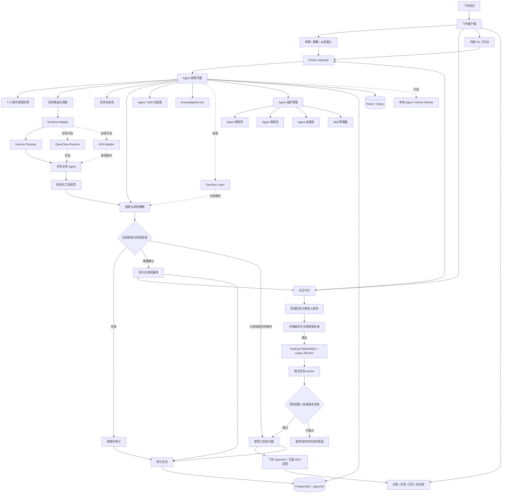
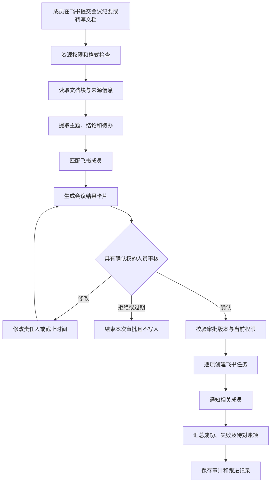
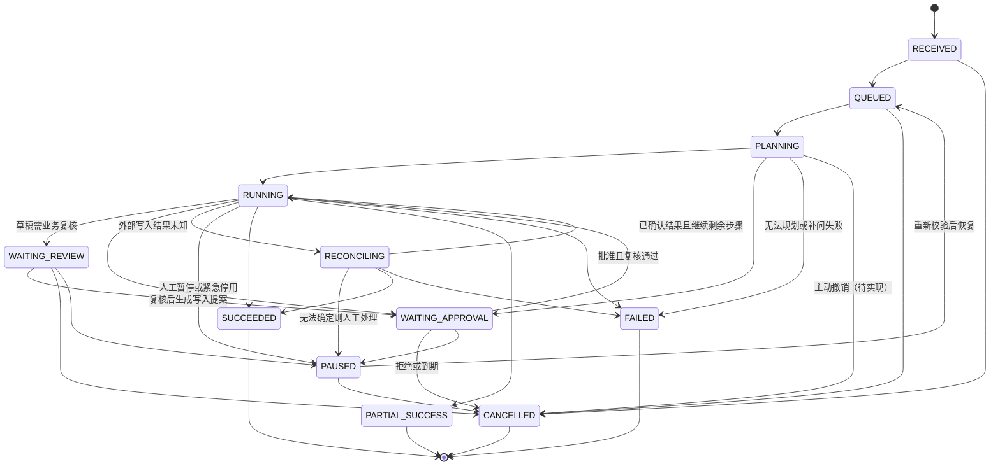
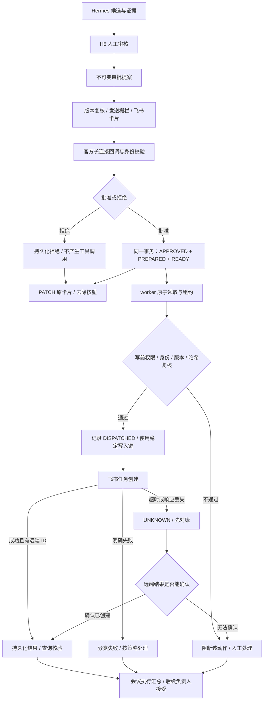
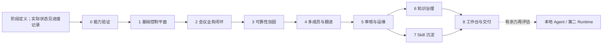

# 飞书 Agent 组织管理系统项目计划书

> 当前实施状态以《进度记录》为准；本文只定义目标、边界、依赖和验收。
>
> 更新时间：2026-10-07

> 文档版本：0.41（设计草案）；功能状态只在《进度记录》中维护。对象、治理流程与飞书权限矩阵均收录在本文；技术设计继续在本文件更新，不另建技术书。

## 1. 项目定位

本项目面向单一飞书企业租户，建设一个小型 Agent 组织管理系统。

项目优先评估 Hermes 作为 Agent Runtime，实际接入方式和隔离能力尚待验证。OpenClaw 作为 Gateway、设备节点和本地 Agent 方向的参考，并保留后续适配可能。飞书作为企业成员的交互入口、业务数据底座和审批入口。自研部分负责个人助手、共享业务 Agent、权限治理、审批、审计、知识检索、知识冲突治理、运维和 Skill 生命周期。

项目最终要解决的问题是：

```text
企业成员如何通过飞书使用个人助手
个人助手如何调用共享业务 Agent
Agent 如何安全访问企业数据
高风险操作如何让人确认
Agent 如何被发现、审核、运行、维护和复用
企业知识冲突时如何避免错误回答
```

项目不是重新实现一个通用 Agent Runtime，也不是一次性制作大量聊天机器人。

### 1.1 官方飞书能力基线与差异化

飞书官网已经展示智能会议纪要、豆包工作/工作伙伴、飞书 OpenClaw 插件、飞书 CLI、aPaaS 和多种 AI 业务能力。因此本项目不把“通用会议摘要”“基础个人助手”“飞书 CLI 封装”或“通用低代码应用搭建”作为主要创新点，而是把这些能力视为可复用的企业底座或候选执行器。具体对比和证据边界见 `docs/官方飞书能力基线与项目差异化.md`。

本项目的核心问题收窄为：如何在已有飞书 Agent 能力之上，统一管理多个 Agent/Runtime 的身份、权限、审批、任务状态、审计、恢复和 Skill 生命周期，并把会议结果可靠地落实为任务。第一版优先接入飞书 Minutes/会议纪要、会议转写或相关文档，也保留腾讯会议等外部会议平台的转写导入适配；所有来源先归一化为带来源、版本、时间和发言人证据的会议文本，再进入同一会议 Agent。自研录音、ASR 和说话人分离从当前范围移除，未来如需支持外部原始音频再单独评估。

`M0`～`M5` 是一页版路线图的粗粒度里程碑别名；阶段 0～8 是本计划书和进度记录的正式编号。进度状态只按阶段 0～8 维护，提到 M 编号时按下表换算，不建立第二套完成状态。导航说明见 `docs/项目总规划一页版.md`。

| 一页版里程碑 | 本计划书阶段 | 对应范围 |
|---|---|---|
| M0 | 阶段 0 | 能力与官方产品核验 |
| M1 | 阶段 1 | 领域模型与最小控制平面 |
| M2 | 阶段 2 | 会议产物到任务的基础链路 |
| M3 | 阶段 3 | Hermes 语义接入与可靠性加固；也补足 M2 的真实 Agent 执行 |
| M4 | 阶段 4、5 | 多成员个人助手、任务跟进、审核官与运维官 |
| M5 | 阶段 6、7 | 知识治理、架构师与 Skill 生命周期 |
| 贯穿各里程碑的交付 | 阶段 8 | H5 完善、部署、演示与论文证据；最小 H5 可提前建设 |

## 2. 总体职责边界

```text
飞书
  用户沟通、文档、知识库、任务、群聊、卡片、H5 入口、用户身份

候选 Runtime（Hermes 优先，OpenClaw 后置）
  复用模型执行循环和可用的工具、Skill 能力；具体能力以选定版本验证为准

A2A（可选的 Agent-to-Agent 互操作边界）
  用于不同进程、Runtime 或服务之间交换任务、状态和产物；不承担权限、审批和最终任务状态

自研控制平面
  个人助手、业务 Agent、事件、任务、权限、审批、审计、知识治理和运维

飞书会议产物
  提供已经生成的会议纪要、转写文本和相关文档；本项目负责授权读取、解析、引用和治理

外部会议平台
  通过受支持的 API 或用户提交的转写文件提供输入；不要求控制平面直接控制外部会议客户端

候选决策模型（Laya）
  对已经结构化的状态做快速分流、风险候选和“询问/执行/转人工”判断；不负责生成正文或最终授权

可选本地 Agent
  访问成员明确授权的本地文件、浏览器和终端
```

推荐部署方式：个人助手和业务 Agent 主要运行在服务器；本地 Agent 只是可选的边缘执行器，不是第一阶段硬依赖。

容器策略：开发和演示阶段采用 Docker Compose 固化数据库、队列和控制平面环境；不引入 Kubernetes，也不要求 Hermes、Laya 或本地 Agent 一开始全部容器化。容器用于可复现部署和进程边界，权限、审批、工具网关和审计仍由应用控制平面负责。

## 3. 总体架构



飞书 H5 只作为管理和治理工作台，不替代机器人、卡片和会话入口。页面按企业业务系统的工作域组织导航：会议审核、我的待办、发起的任务、跟进概览和 Agent 管理分别呈现，会议列表只出现在会议审核域。Agent 管理第一步只读展示租户内个人助手、业务 Agent 和管理 Agent 的当前版本、能力和启停状态；新增配置、权限变更、版本发布和暂停必须后续接入审核官与管理员确认。不同职责的记录不堆成单一任务列表；导航分栏不改变服务端的身份校验和数据可见范围。

本图是目标架构，当前实施证据见《进度记录》。审批监听器与任务 worker 是不同执行职责：监听器记录决定并准备 outbox；worker 消费已批准动作并执行写前复核，批准本身不触发任务创建。PostgreSQL/pgvector 和 Redis/Celery 是后续候选，当前控制平面使用 SQLite WAL；H5 采用现有 FastAPI 页面，不因目标图中技术选型而强制迁移。

## 4. 两个核心循环

### 4.1 业务生产循环

```text
成员在飞书发起任务
→ 个人助手理解意图
→ 选择共享业务 Agent
→ 读取授权数据
→ 提出结构化工具调用请求
→ 当前权限和风险判断
→ 必要时飞书卡片审批
→ 校验审批人、批准内容和当前权限
→ 写回飞书业务对象
→ 返回结构化结果和自然语言说明
→ 保存任务、工具和审批记录
```

### 4.2 Agent 治理循环

```text
收集任务、工具、审批和错误记录
→ Agent 架构师发现重复流程
→ 生成 Agent / Skill 草稿
→ Agent 审核官检查职责、权限和风险
→ 领域负责人确认业务评测、管理员确认权限与发布范围
→ 试运行
→ 正式启用
→ Agent 运维官监控、重试、暂停和告警
→ 根据效果升级、复用或停用
```

业务循环负责交付结果，治理循环负责管理交付结果的 Agent。

治理循环进一步覆盖 Agent 的准入、服役、成长、衰退和退出：感知运行指标与用户反馈，诊断质量退化、失败聚类、知识过期和职责/路由冲突，提出分级行动，再用独立评测、志愿者试运行、版本对比和回滚验证。创建角色负责提出草案，审核角色负责证据和风险预审，生态管理角色负责巡检与改进建议；权限、审批、任务状态与审计始终由控制平面执行，人类承担业务正确性与系统准入的最终责任。

## 4.3 Laya 决策层的候选位置

本节中的 Laya 指 [NandhaKishorM/laya](https://github.com/NandhaKishorM/laya) 开源项目。它是多语言、非自回归的 System 1 typed-decision 模型：输入一段状态和结构化问题，输出选择、评分或概率，不生成长文本。仓库 README 声称支持本地运行、MCP/LangChain 集成和约 8,192 token 的多语言输入；这些性能和准确率仍需在本项目样本上复测。

建议把它放在“决策加速层”，形成：

```text
飞书事件 / Agent 结果
→ 确定性代码抽取可验证特征
→ Laya 输出路由、补问或风险候选
→ 规则引擎复核硬约束
→ 低风险继续 / 信息不足补问 / 高风险人工审批
→ LLM 负责解释、摘要和自然语言回复
```

适合候选场景：

```text
请求属于会议、文档、任务还是知识问答
是否缺少责任人、截止时间或可见范围
工具操作属于低风险、需审批还是直接拒绝候选
会议待办是明确任务、决定、信息还是噪声
运维事件属于权限错误、限流、超时还是模型异常
知识结果是可回答、证据不足还是需要冲突复核候选
```

不适合直接承担：

```text
会议产物解析、长文摘要和自然语言解释
从会议文本中完整抽取复杂任务及证据
最终飞书权限判断、人工审批和安全阻断
在两份制度冲突时决定哪条制度正确
直接调用飞书写入接口
```

Laya 的概率只能作为校准后的决策信号，不能当作安全证明。硬规则优先：例如未授权、已停用、禁止的数据范围直接拒绝；所有写任务仍需审批。模型输出应保存模型版本、问题定义、输入特征、概率和阈值，便于审计和回放。

第一版不依赖 Laya 才能跑通会议闭环。若 V-04 未通过，使用确定性规则和 LLM 结构化输出完成同一流程；若通过，再把 Laya 接入路由和补问等低风险位置，比较延迟、成本、准确率、拒答和转人工率。

## 4.4 容器部署边界

容器不是业务流程的一部分，而是运行和交付方式。建议先采用少量服务：

```text
control-api      FastAPI 控制平面、飞书回调、权限和审批
worker           任务执行、会议产物编排和工具调用队列
postgres         任务、Agent、Skill、审批和审计数据
redis            队列、短期锁和限流状态
frontend         构建后的 H5 静态资源，可由反向代理提供
```

Hermes 作为候选 Runtime 可以先用宿主机进程或独立容器接入，取决于它的外部控制方式和凭证隔离要求；Laya 若需要 GPU，也应先验证宿主机运行、CPU 运行或独立推理服务的资源成本，再决定是否放入 Compose。外部音频 ASR 暂不进入第一版；未来重新启用时再以独立适配器接入，不改变控制平面接口。

阶段 0 可以直接用 Python 虚拟环境完成无副作用验证，数据库只在需要持久化实验记录时通过 Compose 启动。进入主项目后再固定 `compose.dev.yml` 和演示环境配置，生产或答辩服务器只部署单机 Compose。容器重启、数据库备份、日志轮转和密钥注入需要写入部署说明。

不把“放进容器”当成安全保证：容器配置错误、挂载目录、环境变量和网络权限仍可能暴露数据。飞书 token 必须只在工具执行器侧使用，运行时、日志和镜像中不得包含真实密钥；高风险操作仍依赖权限策略和人工审批。

## 4.5 项目端到端流程文字版

### 业务执行流程

项目运行时，企业成员通过飞书单聊、群聊中 @机器人或内嵌 H5 提交任务。以飞书会议纪要或转写文档为例，飞书首先把事件和文档/文件引用发送到后端，后端验证事件来源、成员身份、资源授权和任务范围，并为本次请求创建 `TaskRun`。系统将成员与其个人助手绑定，由个人助手负责理解请求和协调流程，再把专业工作委托给会议 Agent。

会议 Agent 读取经过授权的飞书会议产物，解析文档块、转写文本和已有时间/发言人标记，再根据会议内容提取摘要、决定事项和待办草稿。每条待办都保留对应的原文片段和来源位置。Laya 如果通过适用性验证，可以在这里辅助判断任务类型、信息是否缺失以及是否需要人工补充；它只提供候选判断，不直接决定权限或写入。

控制平面收到会议 Agent 的结构化结果后，检查责任人、截止时间、通知对象和可见范围是否完整，并计算“用户权限、Agent 权限和资源策略”的交集。系统将结果通过飞书卡片或 H5 展示给具有确认权的人员。确认人可以修改、拒绝或补充内容；任何关键字段被修改，原审批都失效，需要基于新版本重新确认。

只有审批通过且执行前复核仍然满足权限和 Agent 状态时，受控工具网关才调用飞书任务接口。Runtime 或 Agent 不直接持有飞书凭证，也不能绕过工具网关写入数据。系统逐项记录飞书返回的任务标识、成功或失败结果；如果远端结果未知，则进入对账状态，不盲目重复创建。最后，个人助手通过飞书返回结构化结果和自然语言说明，并把任务、工具调用、审批、通知和错误写入审计日志。

### Agent 治理流程

系统持续收集任务轨迹、工具调用、审批记录和运行异常，但只处理授权范围内的数据。Agent 架构师从重复且成功的流程中提出 Agent 或 Skill 草稿，草稿包含输入、步骤、工具、权限、风险和人工介入点。审核官先用确定性规则检查权限越界、自审自批和高风险动作，再由管理员进行最终确认。批准后生成不可变版本，先试运行，再按个人、部门或企业范围启用。运维官监控错误、超时、限流和权限失效，可以执行有上限的重试、暂停和告警，但不能自动扩大权限或修改治理规则。

### 项目实施流程

项目实施不从所有功能同时开始，而是先完成阶段 0 能力验证。阶段 0 依次验证 Hermes 的外部控制能力、飞书会议产物/文件和任务接口、官方会议产物读取边界、腾讯会议转写接口可用性以及 Laya 的可选决策能力；自研 ASR 验证列为后置扩展，不再阻塞第一版。若发现飞书官方“智能体任务接入”提供可支持的 CLI/API/MCP/A2A/工作流入口，再作为 V-05 候选验证。每项验证都要记录版本、权限、实验输入、结果、证据和降级方案。

能力验证通过后，先建立最小控制平面，包括成员和个人助手绑定、Agent 与 Skill 版本、任务状态、工具网关、审批和审计。随后必须完成 Hermes `RuntimeAdapter` 和会议 Agent 的结构化语义输出，再把它接入飞书会议产物到飞书任务的垂直闭环。飞书任务 API 打通只证明工具链路可用，不能替代 Agent Runtime 和多 Agent 委托验收。之后补充可靠性、多成员助手、审核官、运维官、知识检索、冲突治理和 Skill 生命周期。H5 随治理功能逐步提供。本地 Agent、OpenClaw 第二 Runtime、外部音频 ASR 和 A2A 跨服务互操作都作为后续扩展。

Agent 主线的最小验收顺序是：

```text
Hermes RuntimeAdapter
→ 会议 Agent 接收受控会议文本
→ 输出 meeting-agent.v1 结构化契约
→ 控制平面校验证据、权限、风险和人工确认
→ 个人助手持久化委托给会议 Agent
→ 会议 Agent 提出飞书任务工具请求
→ 审批和工具网关执行副作用
→ 记录 Agent 运行轨迹、工具调用和最终结果
```

在 Hermes 接入通过前，会议业务只能称为“飞书任务基础链路”或“控制平面垂直切片”，不能称为完整的会议 Agent 产品。

因此，项目的主线可以概括为：

```text
飞书提出需求
→ 个人助手接收并创建任务
→ 业务 Agent 处理专业工作
→ 受控工具网关检查权限和风险
→ 必要时人工审批
→ 执行飞书副作用并记录结果
→ 返回结果、提醒和审计记录
→ 从成功轨迹中沉淀 Agent 与 Skill
→ 通过审核、试运行和运维后再次复用
```

## 5. 领域对象

### 5.1 主要对象

```text
Actor
  User
  PersonalAssistant
  BusinessAgent
  ManagementAgent
  SystemService

AssistantTemplate
AssistantBinding
SourceSubscription
MemoryItem
AgentDefinition
AgentVersion
AgentEvaluation
FeedbackCase
Rollout
TaskRun
TaskStep
Delegation
ApprovalRequest
Skill
KnowledgeClaim
ToolPolicy
AuditEvent
MeetingRecord
```

### 5.2 对象关系

```text
成员
  → 一个默认个人助手
  → 若干可选角色助手

个人助手
  → 接收成员任务
  → 管理个人记忆
  → 委托共享业务 Agent

业务 Agent
  → 执行某一类专业流程
  → 使用已审核的工具和 Skill

管理 Agent
  → 发现流程、审核 Agent、维护运行和治理知识

TaskRun
  → 归属于个人助手
  → 启动时锁定 Agent、Skill 和配置版本
  → 保存人类发起者、业务负责人和版本证据
  → 每次执行仍检查当前有效权限和紧急停用状态

KnowledgeClaim
  → 保存一条带来源、版本、范围和状态的知识声明
```

### 5.3 领域不变量

1. 用户权限与 Agent 权限取交集。
2. 跨部门委托必须显式授权。
3. Agent 修改生成不可变新版本。
4. 运行中的任务固定 Agent / Skill 行为版本；权限撤销和紧急停用立即影响后续执行，版本快照不保留已撤销授权。
5. 高风险操作必须经过人工确认。
6. Agent 之间只能通过受控流程委托，不能自由聊天。未来开放业务 Agent 相互委托时，每条委托链最多 3 条边；目标 Agent 已出现在当前祖先链中即拒绝，防止 A→B→A。链路深度与祖先关系须在并发创建委托时原子校验。
7. 管理 Agent 也属于 Agent，但具有最小启动策略。
8. 个人 Skill 只有经过审核才能共享到部门或企业。
9. 知识声明由知识负责人确认后才能成为正式知识。
10. 任务允许部分成功，但必须保存步骤结果和警告。
11. Agent 输出使用结构化结果加自然语言说明。
12. 所有副作用必须可审计且具有幂等标识；远端结果不明确时先对账，不能假设幂等键能保证外部系统恰好执行一次。
13. Agent 间委托需经过控制平面授权和持久化；个人助手能跟进所有受托子任务，但不会因此得到全部原始内容。
14. 自动改进不能改变工具、权限、数据范围和审批规则；建议模式的试验结果不能直接触发业务写入。
15. 管理员默认只见脱敏运行证据；查看私有正文需另有当前有效的资源授权。

Actor 是统一身份与授权抽象，不要求用面向对象继承实现所有类型。AgentDefinition 保存稳定身份，AgentVersion 保存不可变版本，AssistantBinding 将成员与助手模板绑定。一个逻辑助手不等于一个常驻进程。

新增治理对象的字段与边界：

| 对象 | 关键字段 | 边界 |
|---|---|---|
| `SourceSubscription` | 成员、来源类型/ID、订阅身份、分析范围、频率、状态 | 成员自选；取消订阅或撤权后停止采集 |
| `MemoryItem` | 内容或来源引用、来源版本、时间、可见范围、确认状态、失效条件 | 候选记忆不等于事实；检索前复核当前权限；可查看、纠错、删除 |
| `Delegation` / `TaskRun` | 人类负责人、发起/目标 Agent、目的、输入引用、行为版本、状态 | Agent 直接委托也经过控制平面；权限撤销影响后续执行 |
| `FeedbackCase` | 点踩/退回事件、原结果、来源证据、人工核实结论、归因、共享范围 | 未核实反馈只触发调查；私有内容不自动进入公共评测集 |
| `AgentVersion` / `AgentEvaluation` | 不可变快照、工具/权限差异、评测集版本、新旧结果、失败样本 | 候选版本不能自定通过标准或批准自身 |
| `Rollout` | 志愿者名单、建议/正式模式、观察窗口、样本量、停用/回滚规则 | 志愿者可退出；建议版本不直接执行飞书业务写入 |
| `KnowledgeClaim` / `ConflictDecision` | 来源、适用范围、版本、冲突双方、裁定者、理由 | 创建者与领域负责人确认；兼任时去重；来源更新后复核 |

当前最小实现只允许个人助手委托给该任务绑定的业务 Agent，尚未开放业务 Agent 互相委托；上述深度与去重规则是开放该能力前的验收条件，不能计作已实现。

## 6. 第一条核心业务：飞书会议产物转任务

### 6.1 业务目标

```text
飞书 Minutes/会议纪要、腾讯会议转写或用户提交的会议文本
→ 经过授权的结构化会议文本
→ 会议摘要、结论和待办
→ 责任人与截止时间
→ 飞书任务
→ 成员通知和后续跟进
```

### 6.2 第一版流程



### 6.3 必须区分

```text
发言人 ≠ 责任人
提到某人 ≠ 分配给某人
推测责任人 ≠ 明确责任人
会议结论 ≠ 可执行任务
```

无法确定责任人、截止时间或任务内容时，进入人工确认，不自动猜测。

第一版入口是用户主动提交飞书 Minutes/会议纪要、转写文档、腾讯会议转写文件或文档链接；自动拉取与手动提交都必须记录来源类型、来源 ID、授权身份、版本和获取时间。资源类型、读取接口、权限和大小限制需要验证。授权确认人是否必须是组织者仍待确定，上传者不自动获得为他人分配任务的权力。审批界面必须展示任务正文、责任人、截止时间、通知对象和可见范围；修改这些内容后原审批失效。新建任务与回写文档均需在副作用发生前确认。

第一版可用单张汇总卡片加必要的编辑页面，不承诺复杂表格都能在卡片内编辑。卡片能力不足时在 H5 完成修订，再生成新版本审批。

### 6.4 会议记录保存

```text
会议来源（飞书/腾讯会议/用户提交）
  文档/文件信息、上传者、权限、版本、来源链接、保留期限

规范化会议文本
  文本块、来源位置、时间或发言人标记（若飞书产物提供）

结构化会议记录
  摘要、决定、待办、责任人、截止时间、任务链接
```

第一版不做实时入会、自动录音、自研语音识别、复杂声纹识别、多平台视频下载和情绪分析。外部平台自动拉取只有在 API、账号资质、权限和撤权行为验证后才启用；未验证时统一走用户提交转写文件。

飞书产物中的说话人标签不等于真实成员身份。每条待办关联原文片段与来源位置；同名成员、含糊日期、未明确分工进入待补充状态。飞书原始产物的保留和撤权由飞书负责，本系统只保存必要的来源元数据、规范化文本和审计引用。

## 7. 个人助手和业务 Agent

### 7.1 个人助手

个人助手是成员的统一入口和长期协调者，不是包含所有能力的超级 Agent。它理解需求、选择业务 Agent、持续跟进委托树，向成员汇报结果、等待事项和异常。业务 Agent 可通过控制平面直接受控委托另一业务 Agent，个人助手订阅状态，不充当每一步的人工转发器。

```text
成员
  → 个人助手理解意图
  → 个人助手选择 Skill 或业务 Agent
  → 业务 Agent 执行专业流程
  → 个人助手向成员返回结果和提醒
```

个人助手拥有分层记忆：

```text
个人偏好
个人任务记忆
项目共享上下文
企业正式知识
当前任务临时上下文
```

个人记忆不能自动覆盖企业知识，也不能直接晋升为公共知识。

个人记忆不训练或修改基础模型权重。完整文档按当前资源权限读取；来源更新、撤权、删除或保留期到期时，相关记忆暂停用于回答，随后复核或清除。

个人助手还可在成员选定的来源范围内被动工作：机器人会话、系统任务事件和已订阅资源的变化自动形成候选记忆与只读分析，无需成员逐条标记“请记住”。候选记忆保留来源、版本、时间、可见范围和确认状态；已确认决定与任务状态可长期保留，原文片段按来源授权与保留期管理。失去来源访问权、来源更新或撤销订阅后，旧记忆停止用于回答并进入复核或删除流程。成员可以查看、纠错、删除，但这些操作不是形成记忆的前提。

普通订阅变化进入每日一次、按成员设定时间发送的整合消息；影响既有任务、期限或待审批动作的变化按预设规则即时提醒。Agent 可建议提高优先级，仍受免打扰、频率上限和可见范围限制；无实质变化不发送。飞书文档变更事件的订阅者须有拥有者或管理者权限，不能将“成员可读文档”直接视为可订阅；不满足时提供受控的手动刷新或其他已验证的降级路径。

个人记忆应支持查看、修正和删除。不同成员的会话、记忆、工作目录和凭证必须分别隔离，不能仅凭请求里带有 user_id 就视为隔离成立。

### 7.2 业务 Agent

第一阶段只实现飞书会议产物处理 Agent。后续按优先级扩展：

```text
会议 Agent：会议纪要/转写文档 → 结构化提取 → 待办 → 飞书任务
内容 Agent：文档 → 摘要 → 知识声明 → 文档草稿
任务跟进 Agent：任务 → 进度 → 逾期 → 提醒
社群 Agent：@机器人 → 授权知识检索 → 回答或转人工
```

### 7.3 个人助手、业务 Agent 与任务跟进的唤醒契约

个人助手不是每次都重新调用模型，也不是把任务转发后就丢失上下文。三类角色通过控制平面的持久化记录协作：个人助手持有成员视角的父任务，业务 Agent 执行专业步骤，任务跟进 Agent 只读取授权状态并提出提醒或升级建议。

#### 唤醒来源

```text
成员新消息/上传会议产物
审批决定或人工退回
飞书任务状态变化
截止时间临近或已经逾期
Worker 租约到期、进程恢复或 UNKNOWN 对账结果
成员主动查询进度
```

每次唤醒必须生成可去重的 `wake_key`：

```text
wake_key = tenant_id + task_run_id + trigger_type + source_revision
```

同一 `wake_key` 只允许产生一次有效决策。调度器、飞书事件和人工刷新可以重复到达，但重复到达只能读取已有结果，不能重复委托、重复提醒或重复写入。

#### 每次唤醒的固定顺序

1. **确认身份和绑定**：校验租户、成员、个人助手绑定、当前 Agent 版本和权限交集；身份失效时暂停，不改用应用身份越过成员权限。
2. **恢复持久状态**：读取父 `TaskRun`、子委托、审批、`ToolCall`、outbox 和最近运行事件；不依赖 Runtime 内存或上一次模型会话。
3. **处理阻塞优先项**：先处理待审批、来源版本变化、权限撤销、`UNKNOWN` 对账和租约冲突，再决定是否继续调用模型。
4. **选择下一动作**：只能在“继续当前步骤、向成员补问、创建受控委托、等待远端、升级人工、结束”中选择一种；涉及飞书写入时先生成具体 `OperationProposal`。
5. **领取与执行**：需要副作用时通过 outbox 原子领取；租约冲突换任务，不能盲目重试；模型输出只提供建议，不能直接获得工具权限。
6. **汇报和安排下一次唤醒**：持久化进展、阻塞原因、负责人、截止时间、下一动作和预计唤醒原因。给成员的消息只显示其可见范围内的信息。

#### 跟进 Agent 的状态与通知规则

任务跟进不另造一套远端任务状态，而是把飞书任务状态映射为本地观察状态，并保留原始值：

| 本地观察状态 | 进入条件 | 默认动作 |
|---|---|---|
| `WAITING_OWNER` | 已创建任务，等待负责人接受或补充信息 | 到达约定时间才提醒负责人；不自动改派 |
| `IN_PROGRESS` | 负责人已接受，或有可验证的进展事件 | 纳入每日整合消息；不因无新消息判定失败 |
| `DUE_SOON` | 距截止时间小于提醒窗口 | 向负责人和会议发起人发送一次提醒，受免打扰规则限制 |
| `OVERDUE` | 超过截止时间且未完成 | 升级给负责人和会议发起人；是否改派必须人工决定 |
| `WAITING_HUMAN` | 权限、冲突、审批、负责人或日期无法确定 | 停止产生外部副作用，明确需要谁处理什么 |
| `UNKNOWN` | 远端结果无法确认 | 只进入对账队列，不能当作失败自动重建 |
| `COMPLETED` | 飞书任务和本地业务完成条件均满足 | 归档跟进，保留证据和审计 |

普通进展按成员时区每天最多一条整合消息；影响截止时间、审批、权限或已有任务的变化可以即时提醒。相同事项在同一业务日内只生成一个提醒键，成员可以暂停或调整提醒，不影响任务事实和审计。 

跟进查询先写入 `FollowUpObservation`，再由汇总函数按租户、业务日和收件人生成未发送的 `DailyFollowUpDigest`。当前实现汇总截至查询时保存的最新状态，business_date 只区分通知键，并非当天事件过滤器；成员时区和历史日期快照另行实现。同一远端任务分别保留远端观察和负责人决定，再合成跟进状态；如果一个 `TaskRun` 产生多个远端任务（例如一条会议纪要拆成多个负责人待办），各远端任务分别计数，缺少远端 ID 的旧观察才回退到 `task_run_id` 去重。`DUE_SOON`、`OVERDUE`、`WAITING_HUMAN` 和 `UNKNOWN` 进入待关注列表，`UNKNOWN` 不被折算为失败或完成。每日汇总使用固定的 `tenant_id + business_date + recipient + channel` 通知键，调度器重复触发只读取已有结果，不重复发消息。当前用 `scripts/follow_up_digest_probe.py` 做脱敏预览，输出状态计数和任务引用哈希，固定为 `REMOTE_WRITE=0`、`NOTIFICATION_SENT=0`。观察持久化、汇总生成和消息投递分开验收，周期调度器与飞书出站适配器在此契约稳定后再接入。

H5 通过受保护的 `GET /api/meetings/digest` 提供同一份只读预览。接口校验当前 OAuth 身份并按租户读取观察记录；服务端按会议发起人和单个远端任务负责人过滤，多成员隔离已通过本地测试；真实多成员 OAuth 会话待演示环境验收，业务日期必须是 `YYYY-MM-DD`；返回非零状态计数、待关注任务哈希、通知键哈希以及 `notification_sent=false`、`remote_write=false`。不返回任务运行 ID、远端任务 ID、负责人身份、正文或令牌。页面展示“每日跟进预览”只是帮助成员核对汇总内容，不提供发送、重试、改派或改变任务状态的按钮。2026-10-06 已在服务器容器内对一条已成功保存的远端任务完成一次人工触发的只读观察：远端 `TODO` 映射为 `WAITING_OWNER` 并写入本地观察台账；随后通过浏览器刷新复验 H5，页面显示 `WAITING_OWNER=1`，并明确未发送消息、未写入飞书任务。该验收不代表已启用周期调度或出站提醒。批量入口现已部署为同一固定镜像中的人工触发只读命令，必须显式传 `--all --limit N`，逐项记录成功/失败计数，部分失败返回可见的失败结果，不自动重试；本轮真实读取 5 条远端任务，全部映射为 `WAITING_OWNER`，仍未发送消息或写入飞书任务。

飞书 Task v2 的[官方任务详情文档](https://open.feishu.cn/document/task-v2/task/get.md)仅定义 `todo`、`done`（2026-10-07 核验）。飞书适配器仅接受这两个值，分别表示远端未完成、远端已完成；通用映射函数中的 `DOING`、`IN_PROGRESS` 等别名不能当作飞书已支持的证据，在飞书适配器中统一进入 `UNKNOWN`。无负责人决定时 `todo` 暂映射为 `WAITING_OWNER`；已有明确接受时保留 `IN_PROGRESS`，已有退回时保留 `WAITING_HUMAN`，不让后续 `todo` 查询抹掉本地决定。截止日期可叠加 `DUE_SOON` / `OVERDUE`；`UNKNOWN` 始终保留待核验语义。`done → COMPLETED` 目前只表示远端完成观察，业务验收及归档仍须另行实现；负责人退回与远端完成同时存在时保留 `WAITING_HUMAN` 供人核对。

只读适配器只提取 `guid`/`task_id`、`status` 和 `due.timestamp`，并保留原始状态与标准化结果。缺少远端 ID、缺少状态或响应结构不符合预期时进入 `UNKNOWN`；适配器不从任务描述中的幂等标记推断负责人已接受或业务已完成。真实状态值和事件字段必须用目标租户的只读响应夹具逐项锁定后，才能启用提醒策略。

当前实现提供两个独立的只读入口：`scripts/feishu_task_follow_up_probe.py` 用于单条状态读取，`scripts/follow_up_observe_once.py` 用于将已成功保存的远端引用写入本地观察台账。后者默认拒绝选择；`--latest` 只观察最新一条，`--all --limit N` 才允许有限批量观察。两者都只输出远端 ID 哈希、原始状态、标准化截止时间、跟进映射和固定原因码，并固定打印 `REMOTE_WRITE=0`；不输出任务正文、成员身份、访问令牌或异常原文。读取成功但状态未识别时仍返回 `UNKNOWN`，让跟进 Agent 进入人工核验，而不是把“读到了任务”误报为“任务已完成”。探针结果是观察证据，不替代负责人接受/退回事件，也不直接触发提醒、改派或任务写入。

负责人接受/退回采用本系统 H5 / 卡片显式动作生成的 `OwnerDecisionEvent`，与飞书任务更新事件区分。适配器从已校验的登录会话获取 `IdentityContext`，不能从请求正文构造身份；控制平面复核有效成员、租户及外部身份哈希，并从成功工具调用关联的已批准 `task.create` 提案解析负责人、远端任务和汇报收件人。`source_revision` 明确定义为创建任务时的 `proposal_hash`，不使用模型自报版本或任意远端时间戳。

接受写入 `IN_PROGRESS`，退回必须带非空原因并写入 `WAITING_HUMAN`。inbox 键包含租户、显式负责人动作命名空间和事件 ID；重复请求先重新鉴权，再检查请求内容哈希。同一批准版本只接受一个决定，不同事件 ID 的重复点击仍只落一条观察；接受和退回相互竞争时只允许一个生效，后续纠错走独立人工修订流程。观察、inbox 与成功审计在同一 SQLite 事务提交，中途失败整体回滚。已知远端完成、异常或不确定状态阻断新的负责人决定，要求先对账。此契约只更新本地状态，固定 `remote_write=false`、`notification_sent=false`。

2026-10-07 外部能力核验（事件订阅未做租户联调）：

| 能力 | 官方证据与结论 | 接入边界 |
|---|---|---|
| Task v2 GET | [官方文档](https://open.feishu.cn/document/task-v2/task/get.md)：支持应用/用户身份；`task:task:read` 或 `task:task:write` 任一权限，仍受任务数据访问权限限制 | 继续复用已验证只读查询 |
| `task.task.updated_v1` | [官方 Node SDK 固定提交](https://github.com/larksuite/node-sdk/blob/394c83092395a51402ee408b751d7f9fb05f5518/code-gen/events-template.ts#L4994)：应用创建任务的内容、成员、完成/取消完成等变更，载荷含 `task_id`、`obj_type` | 未证明表达负责人接受/退回；精确 scope 待核验 |
| `task.task.update_tenant_v1` / `task.task.update_user_access_v2` | [同一官方 SDK](https://github.com/larksuite/node-sdk/blob/394c83092395a51402ee408b751d7f9fb05f5518/code-gen/events-template.ts#L4949)：前者含相关用户及任务 ID，后者含 `event_types`、`task_guid` | 不因事件名称推断用户已接受；订阅范围、枚举和租户可用性待验证 |
| Task subscription | [官方 SDK 注释](https://github.com/larksuite/node-sdk/blob/394c83092395a51402ee408b751d7f9fb05f5518/code-gen/projects/task.ts#L10538)：应用身份订阅应用所负责任务；用户身份订阅创建、负责、关注任务 | 应用创建后指派给人，不等于应用仍负责；未调用该 POST，scope 待核验 |

结论：先实现本系统明确的负责人决定入口。未来飞书更新事件只作为只读 GET 的触发信号，经回调验签、事件去重和任务范围校验后复用查询流程；不能直接覆盖本地接受/退回决定，也不能顺带启用消息发送、改派或任务重建。未找到接受/退回字段不等于断言飞书所有产品均无此能力。

H5 的 `GET /api/meetings/owner-tasks` 仅列出当前 OAuth 成员对应的已批准、执行成功的 `task.create` 结果；每一项提供不透明任务引用、已批准版本、标题、截止日期和跟进状态。它不返回原始飞书任务 ID、ToolCall ID 或其他负责人的待办。`POST /api/meetings/owner-tasks/{task_ref}/decision` 通过同源 CSRF 和当前会话校验；正文仅包含事件 ID、提案版本、`ACCEPTED/RETURNED` 与退回原因，服务端重新解析当前负责人和远端任务，不能相信浏览器传入的身份。失败时保留输入，重新加载后可对照最新状态；退回后等待会议发起人处理，系统不自动改派。

每日跟进预览按收件人过滤：会议发起人可看自己会议的观察；负责人只能看自己被指派的具体远端任务，即使同一个 `TaskRun` 下还有其他负责人待办也不可见；无关成员看到空列表。当前一个成员可能同时是发起人和负责人，展示按其授权并集计算。此规则在服务端查询层实施，不能仅依赖 H5 隐藏。旧版缺少远端 ID 的观察只能由会议发起人查看，避免按整场会议误授权给任一负责人。负责人列表与摘要均不使用飞书消息历史权限。

部署验收分层：先用本地测试证明跨成员隔离、CSRF、版本冲突、并发、接受/退回和无远端副作用，再使用服务器 SQLite 在线备份和固定回滚镜像发布，核对服务健康、新接口未登录返回 401、前端资源哈希、原有任务及审批计数。真实成员点击后的 OAuth 与 H5 浏览器联调单独记入进度；服务器安装成功不能替代这项验收。个人助手汇报及每日发送仍在后续迭代。

2026-10-07 的真实负责人点击已证明 H5 接受、带原因退回、持久化观察及审计可以工作；同时发现任务截止日期的写入单位错误，必须作为阶段 4 的阻断条件处理。[飞书 Task v2 创建](https://open.feishu.cn/document/task-v2/task/create.md)与[读取](https://open.feishu.cn/document/task-v2/task/get.md)均规定 `due.timestamp` 为自 Unix 纪元起的**毫秒**，全天日期应设置 `is_all_day=true`。适配器创建时必须将批准的日期转换为毫秒，读取时按毫秒还原；明显为秒级或无法解析的远端值进入 `UNKNOWN`，不生成逾期或完成提醒。无效批准日期不得静默省略。

已创建任务的批准日期与远端日期不一致时，保留原始任务及已做出的负责人决定，并在 H5 显示“截止日期与飞书任务不一致，需发起人核验”。尚未作决定的负责人不能继续接受或退回，汇总状态记为 `UNKNOWN`，不进行自动提醒、自动改期或重建。即使负责人先前已经接受或退回，日期冲突也要在列表显示，不能将其状态当作可靠的正常进度。

发起人修正既有任务日期采用独立的 `TaskDueCorrection`，只允许把远端日期恢复为该任务**原批准提案**中的全天截止日期，不接受浏览器提交任意新日期。H5 并排显示批准日期和最新远端观察；发起人先提出提案，再次核对并显式确认。提案哈希绑定原批准版本、目标远端任务、先前观察及目标日期。只有已批准提案可由一次性 Worker 领取；Worker 重查原任务归属、权限交集、远端状态和原日期后，以[飞书 Task v2 更新接口](https://open.feishu.cn/document/task-v2/task/patch.md)仅 `PATCH due`，随后只读 GET 确认毫秒时间戳对应的全天日期并记录新观察。该接口需要 `task:task:write` 或 `task:task:writeonly`，调用身份还须对具体任务有编辑权；没有 `client_token` 式写入幂等键。因此派发栅栏保证本系统不重复 PATCH，请求或回查结果不明进入 `UNKNOWN`，只允许 GET 对账，绝不自动重发。两次点击本身都不调用飞书写接口；代码发布也不触发旧任务修改。

该修正只处理创建时日期单位错误，不等同于业务改期或改派。已退回任务的决定及原因保留，日期纠正不将其自动改为已接受；负责人更换、协商后的新日期、远端完成状态及 `UNKNOWN` 人工结案仍需单独设计新的受控版本。飞书 PATCH 未提供条件版本字段，写前 GET 与 PATCH 间仍有外部编辑竞争窗口；若回查不符合批准值，保留 `UNKNOWN` 并由人核验。到期日期恢复后仍不自动开启提醒。

#### 重启与恢复规则

```text
等待审批       → 恢复为 WAITING_APPROVAL，等待回调，不重新调用模型
等待负责人     → 恢复为 WAITING_OWNER，按提醒窗口计算下一次唤醒
outbox READY   → 重新领取并执行写前复核
outbox CLAIMED → 租约未过期则等待；租约过期且未派发则允许接管
ToolCall UNKNOWN → 进入 RECONCILING，只查询和记录证据，不自动重建
Agent 版本失效 → PAUSED，通知管理员和领域负责人，保留旧版本结果
```

个人助手可以汇报子任务状态，但不能替负责人接受任务、替管理员批准 Agent 版本，也不能把“已提醒”描述成“已完成”。任务跟进 Agent 的提醒失败与任务写入失败分开记账，补发提醒不重复创建飞书任务。

### 7.4 `MemoryItem` 最小字段与权限边界

`MemoryItem` 是个人助手和知识治理阶段的候选记忆记录，不是“把全部聊天存进向量库”。第一版只定义最小可撤回、可追溯结构，实际建表前先用样例数据完成权限和生命周期测试。

| 字段组 | 最小字段 | 作用 |
|---|---|---|
| 身份 | `memory_id`、`tenant_id`、`owner_actor_id`、`scope` | 区分个人、项目、部门和企业共享范围；任何检索先按租户与范围过滤 |
| 来源 | `source_type`、`source_ref_hash`、`source_revision`、`evidence_refs` | 记录来自消息、文档、任务或人工输入的来源版本和证据块；不以模型摘要替代来源 |
| 内容 | `content_ref`、`content_hash`、`memory_kind` | 支持偏好、决定、任务上下文、事实、观察等类型；正文按保留策略存储或只保存受控引用 |
| 时间 | `observed_at`、`valid_from`、`valid_until`、`retention_until` | 区分发生时间、有效时间和删除时间；过期内容不能继续参与默认回答 |
| 状态 | `lifecycle_status`、`confirmation_status`、`conflict_group_id`、`supersedes_id` | 候选、确认、失效、撤回、删除和被替代都可追踪；未裁定冲突不能晋升为正式知识 |
| 生成 | `created_by`、`generator_version`、`created_at`、`updated_at` | 记录人工、个人助手、业务 Agent 或治理 Agent，以及提示词/解析版本 |
| 检索 | `embedding_ref`、`keyword_index_ref`、`last_retrieved_at` | 只保存索引引用；索引删除或重建不能改变来源事实和权限 |

生命周期固定为：

```text
CANDIDATE → CONFIRMED → ACTIVE
       ↘ NEEDS_REVIEW → SUPERSEDED / REVOKED / DELETED / EXPIRED
```

以下规则优先于检索效果：

1. `recall/reflect` 先验证当前身份、租户、来源资源权限、订阅状态和版本，再进行关键词/向量/实体排序。
2. `CANDIDATE`、`NEEDS_REVIEW` 或存在未裁定 `conflict_group_id` 的记忆不能直接驱动飞书写入、权限变更或任务改派。
3. 来源撤权、删除、版本替换或保留期到期时，相关记忆立即停止默认检索；删除保留不可逆的审计墓碑，不以“向量仍存在”证明可继续使用。
4. 成员查看、纠错、删除和管理员处理冲突都产生新的审计事件；不覆盖原记忆正文和来源证据。

第一阶段只验收“候选记忆可追溯、可过滤、可撤回”，不承诺自动形成长期知识或自动学习用户偏好。向量模型只能帮助召回，不能判断冲突真伪，也不能替代文档创建者与领域负责人的双重确认。

## 8. Agent 组织管理

### 8.1 Agent 架构师

从授权的运行轨迹中发现重复流程，输出：

```text
流程名称
重复次数
步骤和工具组合
建议 Agent / Skill
建议权限
风险等级
人工介入点
预计收益
```

只能生成草稿，不能直接启用。

### 8.2 Agent 审核官

审核：

```text
Agent 职责
输入输出
工具列表
飞书 scope
数据范围
高风险动作
Skill 依赖
审批策略
版本差异
```

规则引擎负责最终阻断，LLM 负责生成解释，管理员负责最终批准。

### 8.3 Agent 运维官

监控：

```text
token 过期
401 / 403 / 429
任务超时
队列积压
连续失败
Skill 依赖失效
模型调用异常
```

可依据确定性规则执行有次数上限的安全重试、重新入队和告警；403 不通过扩大权限修复，结果未知的写操作不盲目重试。涉及增加权限、扩大数据范围、修改策略和重新启用 Agent 的动作必须人工确认。审核官不得自行批准自己的变更，运维官不得任意改代码或扩大授权。

### 8.4 生态管理闭环与责任分离

生态管理角色按“感知 → 诊断 → 行动 → 验证”巡检调用量、成功率、延迟、点踩、经核实的 badcase、知识来源版本和 Agent 路由冲突。单次点踩只触发调查，不直接改版或回滚。人类修正先经业务负责人核实，再作为带来源和范围的评测案例；不能把模型自己给出的修复理由当作正确答案。

| 级别 | 主 Agent 可做什么 | 发布/处置边界 |
|---|---|---|
| L1 | 在预先批准的范围内生成新版本、离线回归和安全测试、向管理员指定的志愿者展示建议模式 | 只能提供建议，不能凭试验版本直接创建任务或写文档；通过最小样本与质量门槛后，正式转正仍由领域负责人和管理员双重确认 |
| L2 | 对行为变化较大的 prompt、知识引用或版本方案形成新旧对比、风险和灰度报告 | 人工确认后发布；未裁定的知识冲突不得自动补录为正式知识 |
| L3 | 对工具增删、权限/数据范围/审批策略变化、下架提出证据和方案 | 人主导决策及执行，管理 Agent 不能自审自批 |

版本快照不可变；志愿者可退出试运行。安全违规立即暂停相关版本；普通质量退化须达到预设的已核实 badcase 或回归失败门槛才自动暂停新版。若旧版仍有效且授权未撤销，运维角色可按预设规则回退并同时通知管理员、领域负责人；否则仅暂停并升级给人。正在运行的新版任务暂停并保留原结果，用旧版另生成对照结果，不静默替换后继续写入。自动修复连续两次失败、评测证据不足或命中 L3 时升级给人。

系统可从跨成员脱敏流程统计中提出新业务 Agent 草案；真实内容进入样本集需源成员授权。领域负责人确认业务评测，管理员确认权限与发布范围，两者通过才准入。会议 Agent 是第一位被治理的业务 Agent，不是项目全部目的。

## 9. 企业知识库与 RAG

知识服务不是单纯的向量数据库，而是：

```text
飞书文档同步
→ 文本解析和切分
→ 保存来源、版本、范围和权限
→ 生成向量
→ 根据当前身份与资源权限限定可检索候选范围
→ 在授权范围内进行关键词检索 + 向量检索
→ 复核来源权限与版本新鲜度
→ 重排序
→ 提取知识声明
→ 版本和冲突判断
→ 带引用回答或转人工
```

知识服务阶段拟使用 PostgreSQL + pgvector。向量模型只负责召回相关内容，不能直接决定哪条知识正确。无权访问的正文不能进入重排模型、生成模型、共享缓存或日志；向量命名空间本身不能替代访问控制。指定会议产物的结构化处理不依赖 RAG。

知识声明状态：

```text
DRAFT
ACTIVE
SUPERSEDED
EXPIRED
DISPUTED
NEEDS_REVIEW
```

冲突判断顺序：

```text
权限有效
→ 来源正式
→ 当前时间有效
→ 适用范围匹配
→ 查验是否存在经过授权的替代关系或例外规则
→ 无明确依据时保留冲突并交知识负责人审核
```

更新时间较新、范围较具体都只能作为判断线索，不能自动覆盖另一条制度。只有适用对象、事项和时间重合而结论不兼容时才形成冲突候选；不同项目的不同规则不一定冲突。回答必须给出来源、有效范围和未解决的分歧。

冲突裁定由相关文档创建者与对应领域负责人双重确认；两种身份属于同一人时只需一次。系统绑定裁定所依据的文档版本，来源改变后重新评估。未裁定时可列出双方说法、来源和适用范围，但不选择确定答案；依赖该结论的写入或分配暂停。管理员只负责 Agent 系统治理，不替代领域裁定。

## 10. 事件、任务和审批

### 10.1 事件信封

```text
event_id
event_type
schema_version
occurred_at
tenant_id
actor
source
task_id
correlation_id
causation_id
idempotency_key
payload
```

### 10.2 TaskRun 状态

```text
RECEIVED
QUEUED
PLANNING
WAITING_REVIEW
WAITING_APPROVAL
RUNNING
PAUSED
RECONCILING
SUCCEEDED
PARTIAL_SUCCESS
FAILED
CANCELLED
```

`TaskRun`、`TaskStep`、`ApprovalRequest`、`ToolCall` 分开建模。ApprovalRequest 使用 PENDING / APPROVED / REJECTED / EXPIRED / INVALIDATED；ToolCall 使用 PREPARED / DISPATCHED / SUCCEEDED / FAILED / UNKNOWN。可重试性属于步骤和错误策略，不混入所有任务状态。

`TaskRun.RUNNING` 表示工作流仍有后续动作，不表示远端写入成功；人工批准后可以处于 `RUNNING`，同时所有工具调用仍为 `PREPARED`。用户可见结果必须读取审批、工具调用与远端结果，分别显示“已批准待执行”“任务创建成功”“负责人已接受”和“业务完成”。

重复卡片回调不能重复执行同一批准动作。审批拒绝或到期时，第一版取消对应待执行分支并记录原因。存在未知写入结果时进入 RECONCILING，不能直接宣布成功或重做全部任务。已完成部分保留远端任务 ID，不自动删除成功创建的任务。

### 10.3 审批记录与幂等键

`ApprovalRequest` 保存一次“允许某个具体副作用”的不可变提案版本。建议字段如下：

```text
approval_id                 本地审批请求 UUID
task_run_id                 所属 TaskRun
step_id                     所属 TaskStep
action_version              提案版本，从 1 递增
operation_type              例如 task.create / document.write
proposal_hash               规范化提案正文哈希
target_ref                  目标资源的脱敏引用或短哈希
requested_by                发起人 Actor
eligible_approver_policy    可确认人规则快照
permission_intersection    用户、Agent、资源策略的权限交集快照
risk_level                  LOW / MEDIUM / HIGH
status                      PENDING / APPROVED / REJECTED / EXPIRED / INVALIDATED
feishu_message_id           展示审批卡片的消息 ID
expires_at                  审批有效期
decided_by / decided_at     实际确认人和确认时间
decision_reason             拒绝、过期或失效原因
created_at / updated_at     本地时间
```

卡片回调只携带外部事件和动作引用，不能把卡片中的文本当作可信提案。收到回调后，控制平面重新加载本地 `ApprovalRequest`，比较审批状态、`action_version`、`proposal_hash`、确认人规则、有效期和当前权限；任何一项不一致都返回“审批已失效”，不执行工具。

需要区分三种幂等键：

```text
callback_event_key = source + event_id
    防止同一个飞书事件重试造成重复处理；事件台账唯一约束。

approval_action_key = approval_id + action_version + decision
    防止用户重复点击同一张卡片造成第二次批准；批准动作唯一约束。

write_idempotency_key = task_run_id + step_id + target_ref + action_version
    防止批准流程重试造成第二次外部写入；工具调用和 outbox 唯一约束。

wake_key = tenant_id + task_run_id + trigger_type + source_revision
    防止事件、调度器和人工刷新重复唤醒同一任务；唤醒台账唯一约束。

notification_key = tenant_id + task_run_id + recipient_actor_id + channel + source_revision
    防止同一状态变化重复发送个人助手汇报；通知台账唯一约束。
```

`wake_key` 只保证一次唤醒决策，不代表业务动作已经成功。唤醒记录要保存触发来源、领取者、状态和结果引用；`COMPLETED`、`BLOCKED`、`FAILED` 都可被重复到达的事件读取。若唤醒过程中进程退出，未完成的唤醒由控制平面按持久状态恢复；涉及外部写入时仍遵守 `ToolCall` 的 UNKNOWN 对账规则。

处理顺序固定为：

```text
接收回调
→ 以 callback_event_key 写入事件台账
→ 加载 ApprovalRequest 并校验状态、版本、提案哈希、确认人和权限
→ 以 approval_action_key 原子地把 PENDING 改为 APPROVED
→ 在同一事务写入 outbox 和 ToolCall(PREPARED)
→ 消费者按 write_idempotency_key 执行或恢复
→ 超时先标记 UNKNOWN 并查询远端，不直接重做
```

用户第二次点击通常会产生新的 `callback_event_key`，但仍会命中同一个 `approval_action_key`；系统应返回第一次批准的结果或“已处理”，不能新增 outbox，也不能再次创建远端任务。提案正文、责任人、截止时间、通知对象或可见范围发生任何变化，都必须递增 `action_version`、重新计算 `proposal_hash` 并重新审批。

任务“创建成功”、按远端 ID“可查询”和在飞书某个会话任务面板“可见”是三个不同条件。需要成员接收任务时，创建请求必须带经过身份映射的 `members`；需要从会议或会话追溯来源时，再填写受控的 `origin` / 引用资源。没有负责人和来源的应用身份任务只能作为 API 能力探针，不能当作业务闭环验收。

### 10.4 任务归属与来源

业务任务至少保存以下归属信息：

```text
assignee_actor_id        控制平面的 Actor
feishu_member_id         经验证的 open_id / user_id，不使用姓名作为唯一标识
member_role              assignee / follower 等明确角色
visibility_scope         责任人、会话或组织范围
origin_type              chat / document / meeting / manual
origin_ref               脱敏的会话、消息或文档引用
origin_url               可选的用户可访问来源链接
```

规则如下：

1. 没有责任人的任务只能用于 API 能力探针，不能作为会议结果落实的成功结果。
2. 从飞书会话生成的任务必须保存会话或消息来源；否则不能承诺出现在该会话右侧任务面板。
3. `feishu_member_id` 必须来自已验证的 Actor 绑定；无法匹配时转人工补充，不用模型猜测或按显示姓名写入。
4. 创建成功、按远端 ID 可查询、在用户界面可见分别记录验收结果；一个条件通过不能替代其他条件。



图中的 `PLANNING → CANCELLED` 是目标设计；当前状态转换实现已有 `PLANNING → FAILED`，但尚不允许从 `PLANNING` 直接取消。启用主动撤销前必须补状态转换与测试。`WAITING_REVIEW` 表示业务字段复核，区别于具体写操作的 `WAITING_APPROVAL`。

数据库状态与待发布事件在同一事务中写入 outbox，消费者按事件和动作标识去重。队列采用至少一次投递假设；本地去重不等于远端 API 的恰好一次语义。审计保留发起人、代理身份、工具、脱敏参数摘要、审批版本、策略判断和远端结果，禁止记录访问令牌。

### 10.5 审批桥接、任务 worker 与恢复设计

以下明确技术职责和下一步验收条件；实现状态和真实计数仅记在《进度记录》，不把设计要求视为已上线能力。

| 组件 | 职责 | 边界 |
|---|---|---|
| H5 会议审核 | 由提交者核对候选、负责人、绝对日期和证据，保存后生成审批提案 | 提交不自动创建任务；当前发卡由操作员桥接入口触发 |
| `MeetingApprovalBridge` | 发卡前检查会议属主、提案来源和文档版本；复用已发送记录 | 发送栅栏为 UNKNOWN 时禁止自动重发 |
| `FeishuApprovalGateway` | 绑定消息、收件人和提案哈希；核对应用、操作者、动作版本及当前权限 | 只从官方 SDK 长连接分发入口接收真实回调 |
| 审批监听器 | 持久化批准/拒绝；批准原子准备 ToolCall 与 outbox，异步 PATCH 原卡片 | 不消费任务 outbox，不持有“批准即执行”的隐式路径 |
| 独立任务 worker | 领取已批准动作，写前复核，调用受控飞书任务适配器，持久化结果 | 不调用 Hermes 重写已批准正文，不执行拒绝项 |
| 对账与汇总 | UNKNOWN 先核实远端结果；汇总已创建、拒绝、阻断、失败和待执行项 | 不删除已成功任务来重做整批，不把任务创建当成负责人接受 |



worker 开启前的最低要求：

1. 只领取当前批准版本的 `PREPARED` 动作及 `READY` outbox。用数据库原子领取、属主和租约防止两个消费者同时派发；领取状态与租约字段须单独实现和验证，不仅依赖进程内集合。
2. 再次校验租户、当前用户/个人助手/业务 Agent/版本权限交集、ToolPolicy、负责人身份绑定、审批版本与提案哈希。重新读取源文档版本及其在本次调用身份下的可访问性；应用身份可读不能推断发起用户可读。版本改变、撤权或绑定不一致时阻断并报告，不静默改写提案。
   当前真实 Feishu 网关已将这条要求固化为写前预检：必须存在会议记录和本地来源快照，会议租户/提交者必须与任务租户/发起人一致，提案中的来源文档 ID 哈希和修订版本必须与会议记录一致，负责人必须是同租户内有效用户且存在稳定的外部身份映射；最后重新读取源文档修订版本并复核负责人绑定。任一检查失败都在本地结束为失败，不调用任务创建 API。
3. 在外部请求前持久化派发意图，使用已有稳定写入键对应的 `client_token`；成功后保存远端任务 ID、工具结果和 outbox 消费结果。提交结果必须支持重启恢复，不能只保存在 worker 内存。
4. 已领取但尚未进入派发意图的动作可按租约恢复；已记录派发而无最终结果的动作按 UNKNOWN 对账。远端幂等有效期和查询能力需单独验证，不能仅因租约到期就重新创建任务。
   对 Feishu Task v2，稳定写入键仍作为 `client_token`。对账优先使用本地已保存的远端任务 ID，并要求 GET 成功且返回同一 ID。描述中的 `fde_idempotency_key` 是可编辑线索，不是可信创建回执：即使只找到一个匹配项，也不能据此自动把 UNKNOWN 改成 SUCCEEDED。列表只代表当前身份可见范围，空列表不证明未创建；2026-10-05 同服务器已知 5 个任务 GET 成功而列表返回 0 条，实测记录见进度文件。
   候选检索须遍历完整可见分页（上限 20 页），非对象 JSON 不匹配，多匹配、分页循环/缺失、页数耗尽和 API 错误均保留不确定性，不选择第一条。现有可信 ID 缺失且仅有描述线索时，维持 RECONCILING 并交人工核对，禁止用 CREATE 重放来冒充查询。
   对账提交须在同一事务内更新 ToolCall/outbox，并复查当前状态和活动租约；慢查询不得覆盖另一个进程已确认的成功。PREPARED、已结束动作及活动 Worker 租约不得经对账旁路派发。诊断只保存固定错误类别，不保存 SDK 原始异常。
5. 区分只读复核失败、明确请求拒绝与写入结果未知。限流或 token 更新后的重试不能覆盖 UNKNOWN；无法证明未创建时保持人工处理，不自动补写。
6. 单条先验收创建成功、按 ID 可查询及负责人界面可见；再验证剩余动作。混合批准/拒绝时逐项保留决定，最终状态汇总按明确业务口径计算；当前通用 TaskRun 的转换不能直接代替多事项会议汇总。

监听器部署与运维要求：同一演示应用保持一个正式业务监听器，避免临时探针分流；容器重启后的自动启动、进程监督、重连、脱敏连接状态与告警必须有独立验收。进程存活、WSS 握手成功、飞书后台“连接成功”、真实按钮回调到达是不同证据。后台验证成功后的回调恢复不能单独证明此前故障的根因。日志禁止输出带 `access_key` / `ticket` 的 WSS URL 或原始凭证。

卡片最终状态采用持久消息 PATCH；回调 Toast 只证明操作被处理。PATCH 失败不撤销已持久化审批，保留恢复入口并提示更新待重试；任务执行后应依据工具结果更新展示，不继续将“已批准待执行”当作最终业务成功。

会议 H5 详情页还应提供脱敏的执行结果摘要：显示每条批准动作的状态、固定错误类别、outbox 状态和是否已有远端引用，不显示远端任务 ID、幂等键、open_id 或令牌。执行失败、阻断和 UNKNOWN 必须在页面重新加载后仍可见，供会议发起人和运维角色继续处理；摘要本身不提供重试按钮，也不改变已有审批和写入状态。

### 10.6 服务监督与可回滚发布

服务拆成同一固定镜像的三个容器，使用 Docker Compose 和 `restart: unless-stopped`，不额外引入 Kubernetes 或任务队列：

| 服务 | 运行内容 | 健康与权限边界 |
|---|---|---|
| fde-control-plane | OAuth、H5、控制平面 HTTP API | 仅绑定 127.0.0.1:8210；HTTP /health 探针；384 MiB 上限 |
| fde-approval-listener | 唯一正式长连接审批监听器 | 不启动 Worker；进程退出自动重启；256 MiB 上限；进程存活不等于回调已到达 |
| fde-task-worker | 第一轮为持续只读队列巡检 | `--loop --dry-run`；数据库只读挂载、无网络、无凭证；128 MiB 上限；成功巡检才刷新健康心跳 |

巡检以 30 秒为周期，只在队列计数变化时记录日志，SIGTERM/SIGINT 触发正常退出。健康检查发现心跳超过 90 秒会标记 unhealthy；Docker 的 restart 策略针对进程退出，不会仅因 unhealthy 自动重启。容器初次启动按 API 健康条件排序；主机启动后的长期行为和真实回调连通性需单独验收。

第一轮监督**不启用持续创建任务**。`--loop` 缺少 `--dry-run` 直接拒绝；单次受控执行入口保留。真实网关的来源版本、租户、提交者、负责人和外部身份映射预检已经固化在 Worker 执行路径，并有本地阻断测试；开启持续写入前仍需用一条新的、明确批准的测试事项完成真实单次验收，覆盖撤权、来源更新、成员映射缺失、进程崩溃和审批变更。不能把本地权限交集或预检测试误报为持续写入已经上线。

发布流程：在线备份 SQLite；保存当前源码与旧 Compose；基于已有依赖镜像离线构建新版本及回滚镜像；新镜像在隔离数据副本上检查导入、SDK 夹具、dry-run 和对账 inspect；服务端 Compose 固定镜像标签且移除 build 字段，避免误用旧源码重建。验证后仅 `up -d --no-build` 指定本项目服务，禁止 `down` 或 `--remove-orphans`。日志轮转为每服务 5 MiB × 3。

回滚优先只退代码：停止新监听器与巡检服务，再使用固定旧镜像启动网页服务，保留当前业务数据库。数据库备份是恢复检查点，不在普通版本回退时覆盖，否则可能丢失发布后审批。回滚镜像先在无网络容器和备份副本上验证健康；隔离演练不等于真实在线回滚已经发生。

## 11. Runtime 和工具接口

下面是期望由自研适配器提供的能力草案，不是已验证的 Hermes 原生 API，也不是当前要编写的代码：

```python
class RuntimeAdapter:
    def create_session(self, assistant_context): ...
    def run_task(self, task): ...
    def pause_task(self, task_id): ...
    def resume_task(self, task_id): ...
    def get_trace(self, task_id): ...
```

所有 Runtime 只能调用受控工具：

该约束必须由部署和工具注册方式保证，不能只靠提示词。飞书凭证保存在工具执行器侧；Runtime 不直接持有凭证，也不能通过默认终端、网络或其他工具绕过网关。是否能在选定 Runtime 中做到这些，是接入门槛。第一版不自研通用沙箱，但不能省略必要的进程与凭证隔离。

等待人工审批时持久化动作提案与执行上下文，结束或让出当前执行。回调后恢复受控工作流，不要求 Runtime 进程一直挂起。`pause_task` / `resume_task` 可以由控制平面实现。

```python
class FeishuToolGateway:
    def authorize(self, principal, tool, resource): ...
    def check_risk(self, tool, arguments): ...
    def request_approval(self, operation): ...
    def invoke(self, tool, arguments): ...
    def write_audit_log(self, call): ...
```

推荐工具示例：

```text
meeting.audio.read
meeting.transcribe
feishu.doc.read
feishu.task.create
feishu.im.card_send
feishu.im.message_send
```

使用 lark-openapi SDK 调用 OpenAPI 不等于使用 MCP。优先验证受控 OpenAPI 执行器；如展示目标需要 MCP，再用同一授权逻辑增加 MCP 服务或适配器，并单独验收。

### 11.1 A2A 的使用边界

A2A 与 MCP 解决的不是同一层问题：

```text
A2A：Agent ↔ Agent，交换任务、状态、消息和结构化产物
MCP：Agent ↔ Tool，发现并调用工具或资源
飞书：成员 ↔ 系统，提供会话、文件、卡片和企业业务对象
自研控制平面：身份、授权、委托、审批、审计、状态和恢复
```

本项目建议采用“内部契约优先、A2A 适配可选”的策略：个人助手和会议 Agent 在同一控制平面内时，使用持久化 `Delegation`、`TaskRun` 和队列通信，不为了协议形式增加网络跳转；当 Agent 位于不同进程、不同 Runtime 或独立服务时，再通过 A2A Adapter 对外交换请求和结果。

A2A 请求进入系统后必须转换为内部任务，并经过当前用户权限、Agent 范围、数据范围和风险策略检查。A2A 对端不能凭协议本身获得飞书权限，也不能绕过人工审批、工具网关或审计。对端返回的消息和产物按不可信输入处理，不能改变本地权限策略。等待审批时由控制平面持久化任务并返回等待状态，不能要求远端 Agent 无限期占用进程。

第一版不同时实现多个 A2A 对端。阶段 0 只验证候选 Runtime 是否有稳定的任务边界、身份认证、状态查询和结构化产物能力；阶段 1–2 先完成内部委托和会议闭环；若后续确有第二 Runtime 或独立 Agent 服务，再实现一个最小 A2A 适配器作为互操作演示。A2A 适配器的验收是“能受控地互操作”，不是把协议当作系统的安全边界。

## 12. 分阶段实施计划

### 阶段 0：概念和能力验证

目标：确认 Hermes、飞书会议产物/任务能力和 A2A 适配是否满足控制平面需要；不同时接入两个 Runtime。自研 ASR 已从第一版范围移除，阶段 0 不再以 ASR 作为进入阶段 1 的门槛。此处保留原始出口定义；当前完成情况见进度记录。

出口条件：

```text
至少一个 Runtime 可以被外部控制
可以调用自定义工具
可以返回执行轨迹
可以明确区分内部委托和 A2A 对外互操作边界
飞书可以接收文件事件和卡片回调
确认对应文件下载方式、身份类型、最小 scope 和资源授权
确认任务创建接口的身份、字段、通知行为和去重/查询能力
飞书官方会议产物可以被授权读取、解析并保留来源证据
```

验证真实写入前，使用演示资源、限定目标和人工批准的测试动作，保留请求及结果证据。锁定外部项目版本并阅读该版本许可证；语言、GitHub 星数或仓库元数据不能证明可嵌入性、隔离性或许可条件。

### 阶段 1：领域模型和最小控制平面

目标：建立 Actor、个人助手、Agent、版本、任务、审批、工具和审计模型；在真实业务写入前具备 OAuth/应用身份边界、权限交集、回调验真、审批绑定、去重和凭证隔离的基础控制。

出口条件：不依赖真实模型也能模拟完整任务、审批、失败和恢复流程；越权、篡改审批、重复回调均被阻断。阶段 0 的真实 API 探测通过后，阶段 2 上线前还必须通过这套控制的集成验收。

### 阶段 2：飞书会议产物垂直切片

```text
飞书会议纪要 / 转写文档
→ 授权读取与结构化解析
→ 会议结构化提取
→ 责任人匹配
→ 卡片确认
→ 飞书任务
→ 成员通知
→ 审计
```

### 阶段 3：企业化可靠性

在既有控制上强化 token 失效、限流、进程重启、outbox、并发回调、部分成功和写入结果未知的对账恢复；形成故障演示与回归证据。

推进顺序：真实 docx → Hermes 证据草稿 → H5 人工审核 → 飞书审批卡片与本地动作准备 → 独立 worker 写前复核及单条写入 → 剩余事项执行与对账 → 混合结果汇总与故障恢复。审批回调验收是中间出口，不能替代真实会议任务创建。当前任务适配器、持久化 worker、写前预检和本地 UNKNOWN 状态机已经接通，并完成了 5 条批准动作的真实创建与按 ID 核验；持续 Worker 写入、无回执 UNKNOWN 恢复和跨进程 Runtime 恢复仍需单独验收，不要为恢复执行重新生成已审批草稿。

本阶段开始统一采集任务、委托、Agent/提示词版本、工具结果、延迟、反馈和脱敏 badcase 元数据，为后续治理建立基线；采集不等于已具备自动诊断或改版能力。

### 阶段 4：个人助手和任务跟进

加入多成员、个人记忆、责任人个人助手、逾期提醒和会议事项跟踪。

先做成员与机器人会话、系统任务事件的被动记忆及每日整合消息；文档变化订阅须先验证订阅身份的拥有者/管理者权限。成员自选来源，普通变化汇总、关键变化即时提醒。会议发起人确认后可创建任务；相关负责人接受或退回，退回理由由审核角色分类，实际改派仍由会议相关人员决定。

### 阶段 5：审核官和运维官

加入 Agent Manifest、版本审核、启停、健康检查、告警和自动重试。

补齐版本快照、评测集、反馈复核和发布规则：系统从脱敏重复流程提出草案，领域负责人确认业务质量，管理员确认权限及发布范围。先落“巡检只建议、人工发布”，再验证志愿者建议模式的 L1 试运行与预设回滚；L2/L3 分级自治不作为阶段 5 的默认完成条件。

### 阶段 6：KnowledgeService 和内容 Agent

加入 pgvector、混合检索、知识声明、版本、冲突检测、引用回答和文档写入审批。

### 阶段 7：架构师和 Skill 生命周期

```text
运行轨迹
→ 重复流程
→ Agent / Skill 草稿
→ 人工审核
→ 个人、部门或企业范围启用
→ 复用效果统计
```

在准入与运维基础上串起生态巡检、badcase 聚类、知识过期、职责冲突、L1 建议模式、L2 提案和 L3 人工处置。人类修正经核实后进入案例库与独立回归集；版本转正需要领域负责人和管理员双重确认。默认不以全量聊天旁听作为数据来源。

### 阶段 8：H5 完善与交付

阶段 2 如需编辑会议结果，可先做最小 H5 页面；阶段 5–7 随治理功能补充管理页面。阶段 8 集中完善 Agent 管理、Skill 审核、知识冲突处理、任务与审计查询，完成部署说明、演示录屏、测试报告和论文材料。本地 Agent、OpenClaw 第二 Runtime 和 A2A 互操作属于可选扩展，不作为本阶段完成门槛。

各阶段是依赖顺序，不是固定月份承诺。建议按 1–2 周的小迭代组织未来实施，每次只承诺一个可验收结果；设计讨论、学习和外部能力验证单独记录，不计成功能完成。



## 13. 范围优先级

### 第一业务里程碑：会议闭环

```text
会议产物解析
待办和责任人提取
人工确认
飞书任务创建
个人助手基础绑定
权限策略
任务状态
审计日志
```

### 项目目标版：组织管理与毕业交付

```text
任务跟进
审核官
运维官
Skill 生命周期
RAG
知识声明和冲突标记
H5 管理与审核工作台
可复现测试、部署说明、演示录屏和论文证据
```

完成会议闭环只能说明业务可用，不能据此宣称完整的 Agent 组织管理系统已完成。审核、运维、版本和 Skill 生命周期是项目定位的重要交付；RAG 与知识治理的深度可按剩余时间协商收缩，并同步修改论文与简历表述。

### 时间风险与砍单顺序

若剩余时间不足，以可验收的会议 Agent 闭环和组织治理主线为准，按以下顺序收缩；每次收缩先在进度记录中写明触发原因、删去的验收场景和论文影响，再修改目标版依赖，不能只在实现中悄悄跳过。

1. 先后置 K-02/K-03 的知识冲突裁定，保留必要的来源引用和权限检查；知识冲突识别与双确认不再计入该版验收。
2. 再后置 G-04 的 L2/L3 改进流程，保留 G-01/G-02 的准入审核、审计、暂停与告警；只展示有证据的人工发布或低风险建议能力。
3. 最后才考虑后置 S-01/S-02；这会削弱“Skill 生命周期”核心定位，必须同步调整第 13 章目标版、第 18 章 D-01 对 S-02 的依赖、第 15 章指标、演示和论文/简历表述。当前 D-01 仍以 S-02 为依赖，未批准范围变更前不得宣称目标版完成。

无论如何收缩，保留 M-01～M-04 的真实 Agent 会议流程与人工确认、R-01 的写入可靠性、G-01/G-02 的审核运维、最小 H-01 工作台和 D-01 的可复现交付。若连这条线也无法验收，应如实缩小项目名称与结论，不用未实现的目标填充答辩材料。阶段是依赖顺序而非固定月份，不据未经确认的个人日程设截止日期。

### 后置

```text
实时会议机器人
复杂声纹识别
完整社群 Agent
本地 Agent
OpenClaw 第二适配器
多媒体平台下载
```

## 14. 可行性和降级方案

### Runtime 风险

Hermes 和 OpenClaw 都是快速变化的外部项目。系统不依赖它们的内部类，只依赖 RuntimeAdapter。如果 Hermes 无法提供稳定的暂停、追踪或工具控制能力，先评估由控制平面持久化工作流、Runtime 仅处理无凭证的文本任务这一降级路径；阶段 0 已验证 Hermes A2A 的任务表无法跨 adapter 重启恢复（证据：[阶段 0 V-01 验证记录 §3.8](阶段0-V-01-Hermes验证记录.md#38-重启后任务恢复边界)，进度记录“2026-09-25 V-01 Hermes 验证”），因此审批等待、durable TaskRun 和恢复/对账责任固定归属控制平面。仍不满足隔离要求则暂不接入真实业务工具。会议主线可使用确定性工作流和模型适配层，但必须如实说明 Runtime 接入情况。

### 飞书权限风险

第一阶段优先验证用户 OAuth、文件读取、卡片回调和任务创建。只申请最小 scope，不把全量群消息读取作为依赖。

官方接口存在更广的用户身份消息搜索和指定会话历史读取能力，但属于需要单独授权的高级权限，不能与机器人接收事件混同。当前租户未验证这些用户身份权限、OAuth 授权和持续访问能力；“默认旁听所有成员聊天”不进入目标版。具体权限矩阵、官方依据及待验证条件见第 22 章。

Task v2 创建接口接受 `task:task:write` 或更窄的 `task:task:writeonly`；前者在官方权限目录还覆盖删除和成员调整。现有测试权限不自动成为正式版最小权限方案，进入多成员阶段前复核 `writeonly` 加必要只读权限能否满足创建、查询和 UNKNOWN 对账。

### 会议产物依赖风险

飞书官方 SDK 已暴露 Minutes 资源的详情、产物和 transcript 读取入口（包括按 `minute_token` 获取 transcript 的接口），但本项目仍需在目标租户验证 minute token 来源、应用/用户身份权限、真实自动会议产物格式和撤权行为。腾讯会议官方 OpenAPI SDK 也暴露录制地址、录制详情、转写详情、发言人和智能总结接口，但其 SDK README 要求企业版及应用凭证，不能据此推断个人账号或当前租户已经开通。若任一自动接口、权限或格式不稳定，统一降级为用户上传转写文件或在 H5 粘贴会议结果；不在第一版临时引入自研录音转写。

### 范围风险

会议闭环完成前不扩展 RAG、本地 Agent、社群 Agent和多媒体平台生态。

## 15. 验收指标与证据

```text
会议产物解析成功率
待办提取准确率
责任人匹配准确率
未授权工具调用阻断率
高风险操作拦截率
重复审批造成的重复写入次数
任务部分成功处理正确率
API 异常恢复率
知识检索 Recall@K
知识冲突识别准确率
人工转交率
Skill 复用成功率
端到端业务完成时间
个人助手订阅事件的有效分析率、每日摘要合并率和误报率
Agent 版本回归通过率、志愿者建议纠错率和回滚时间
符合预设 L1 条件的案例中无需人工完成的比例（自治率）
```

自治率必须同时报告符合 L1 条件的案例总数、质量结果、人工升级率与回滚率，不能通过缩小分母或忽略失败案例制造增长曲线。灰度转正须有预设最低样本量和观察期；仅“跑了几天”但调用不足时继续观察。

先建立有人工标注的小型会议样本集，再确定质量目标。开发样本与验收样本分离，记录样本数量、模型/提示词/解析版本与失败案例。待办提取分别统计精确率与召回率；责任人指标单列“可确定”和“需人工补充”，不因合理转人工而伪造自动化成功。Recall@K 需说明 K、查询集与相关文档标注。

安全与正确性使用明确的通过条件：未批准不能产生对应写入；无权正文不能进入模型；重复确认不能重复调度同一动作；部分失败不能被显示为全部成功。全部通过只代表当前验收样本通过，不承诺生产环境零风险。耗时、模型费用和人工修订量先测基线，不凭空填写提升百分比。

## 16. 进度维护规则

每次开始工作前：

1. 读取本计划书。
2. 读取 `docs/FDE-Agent-组织管理系统-进度.md`。
3. 确认当前阶段、已完成项、阻塞项和本次目标。

每次完成一个功能或阶段后：

1. 仅在进度文件中更新功能和阶段状态，计划书只维护范围、依赖、决策和验收要求。
2. 在进度文件中记录完成时间、改动内容、验收结果和遗留问题。
3. 记录新的技术决策和被放弃的方案。
4. 更新下一步建议。

如果上下文中断，恢复顺序固定为：

```text
进度文件当前快照 → 计划书相关章节 → 决策及验收证据 → 当前阻塞项 → 下一步目标
```

当前状态与实现计数只在进度记录中维护；历史阶段定义不能覆盖已完成的代码与真实环境证据。

中途停止也必须记录停在哪一步、未完成原因和下次第一步。状态“已完成”必须有验收证据；讨论结论、文档修改、代码完成、真实环境验收四者分别记录。不得把现有学习项目的代码计入本项目进度。

## 17. 决策分级与技术基线

| 级别 | 内容 | 后续处理 |
|---|---|---|
| 已确认方向 | 单租户、服务器为主、飞书入口、成员助手与共享业务 Agent、首个业务为飞书会议产物转任务 | 改变时记录原因和影响 |
| 已确认边界 | 本地 Agent 可选；写任务和文档先审批；目标版不依赖全量群消息或用户聊天抓取 | 扩大消息读取范围需独立设计评审、用户授权、租户审核和实测 |
| 当前技术基线 | Python/FastAPI、SQLite WAL、自研控制平面与 outbox、lark-oapi OpenAPI/长连接、Hermes CLI RuntimeAdapter、FastAPI H5 页面、Docker Compose 与 HTTPS 反向代理 | 具体实现、版本和真实验收证据见进度记录；SDK 不等于 MCP，SQLite 不等于 PostgreSQL |
| 优先复用候选 | 现有 Pydantic 扩展到新增配置与输出契约；Promptfoo 离线评测；APScheduler 稳定 3.x 定时巡检与每日汇总 | Pydantic 已使用，但新增领域用途仍需验证；其余只完成文档/源码适配评估，试接通过后才计入实际栈；详见第 21.3 节 |
| 后续候选选型 | PostgreSQL/SQLAlchemy/Alembic、Redis/Celery、React/Ant Design、OpenClaw 第二 Runtime | 根据多成员、检索及恢复需求决定，不因目标架构图强制迁移 |
| 后续知识方案 | pgvector、关键词与向量混合检索、可选重排 | 会议闭环不依赖此项 |
| 待验证假设 | Runtime 工具限制与隔离、飞书会议产物读取/卡片/OAuth/任务能力、官方产物版本与权限行为 | 必须有版本、官方依据或实验记录 |
| 待业务决定 | 谁可批准分工、成员如何接受或退回、敏感会议可见范围、会议产物保留期 | 不使用技术默认值替代业务授权 |

模型调用采用兼容 OpenAI 接口的适配层，会议产物解析接口单独封装；具体提供商与预算尚未确定。M-02 的正式质量基线建立前，必须锁定一组默认评测配置：提供商与精确模型 ID、可用版本/日期、温度及推理参数、提示词版本、解析版本、样本集版本，并记录成本和延迟。DeepSeek 可作为优先评测候选，但现有探针不足以证明某一型号适合作为最终默认值；选定后用同一验收集比较，换模型须重建或明确标注新基线。基础阶段允许用进程内任务执行验证流程，是否立即引入 Celery 由持久化与恢复需求决定，不能把技术栈数量当作成果。

## 18. 功能编号与交付清单

编号用于进度、测试和决策的关联，删除功能保留编号并标记延期/取消，不重新分配。表中列的是目标，不表示当前完成。

| ID | 功能 / 输入 → 输出 | 依赖 | 最小验收与应保留证据 |
|---|---|---|---|
| V-01 | Runtime 版本与配置 → 接入结论 | 无 | 自定义工具、结构化输出、轨迹、会话/凭证隔离验证；许可证及版本记录 |
| V-02 | 演示租户与资源 → 飞书能力矩阵 | 无 | 文件下载、身份、最小 scope、卡片回调、任务创建与通知行为逐项有依据；脱敏实验记录 |
| V-07 | 官方消息/文档权限文档 → 设计权限矩阵 | V-02 | 区分机器人事件、用户身份消息搜索/历史、文档订阅的授权条件；当前租户未获批项标待验证，不做真实聊天抓取 |
| V-03 | 授权会议音频 → ASR 选型报告（后置/取消） | 无 | 不作为第一版或阶段 0 出口条件；未来若接入外部音频，再重新启动并补齐授权、质量和许可证证据 |
| V-06 | 飞书会议产物 → 会议记录接入结论 | V-02 | 能读取 Minutes/专用会议纪要或转写文档，保留来源位置、版本和权限证据；解析失败可见并能降级为人工整理；官方 SDK/API 入口仍需在目标租户实测 |
| V-08 | 腾讯会议录制/转写/纪要 → 统一会议输入结论 | 无 | 锁定官方 OpenAPI 版本、企业账号资质、应用凭证、录制文件/转写/智能总结接口和权限；能获得可引用的文本与发言人/时间信息，失败时降级为用户提交转写文件；不把 SDK 存在等同于目标账号已开通 |
| V-04 | 标注决策样本 → Laya 适用性报告 | 无 | 路由/补问/风险候选与规则基线对比；记录模型、问题 schema、阈值、校准、延迟和失败样本；证明硬规则可覆盖模型误判 |
| V-05 | 飞书官方智能体接入线索 → 外部 Agent/Runtime 适配结论 | V-02 | 锁定官方入口、身份授予、任务指派、回调/状态、撤销和许可证；证明它能否通过受支持接口接入 `ExternalAgentAdapter`；页面命令不能直接视为已开放 API |
| C-01 | 成员身份 → Actor 与助手绑定 | V-02 | 一人一默认助手；他人身份伪造被拒绝；身份映射记录 |
| C-02 | 定义/版本/输入 → TaskRun 与步骤 | 无 | 固定行为版本、保存人类负责人、受控委托；状态转换记录 |
| C-03 | 工具请求 → 允许/拒绝/待审批 | C-01, C-02, V-01 | 用户与 Agent 权限交集、当前权限复核、凭证不暴露给 Runtime；拒绝样例；Laya 只能提供候选，不可绕过硬规则 |
| C-04 | 操作提案与卡片回调 → 审批结论 | C-03, V-02 | 审批人校验、动作内容绑定、过期/修改失效、重复回调去重；审批轨迹 |
| C-05 | 事件与工具调用 → 审计及执行台账 | C-02 | 可追溯谁因何执行、结果与远端 ID；不记录令牌；脱敏审计样本 |
| M-01 | 飞书会议产物 → MeetingRecord 与规范化文本 | V-06, C-03, C-05 | 授权读取、版本/来源记录、文档块解析、失败可见；样本产物 |
| M-02 | 规范化会议文本与参会信息 → 会议待办草稿 | M-01 | 每条待办可追溯；未明确分工、同名、含糊日期和可能重复/冲突事项不被强行确定；Laya 若参与分类须与规则/LLM 基线比较 |
| M-03 | 草稿与人工修订 → 已批准动作集 | M-02, C-04 | 展示责任人/期限/通知范围；修改产生新版本；批准人资格有记录 |
| M-04 | 批准动作集 → 飞书任务与结果 | M-03, C-05, V-02 | 创建前复核；记录逐项结果/远端 ID；部分失败可见；真实任务链接 |
| R-01 | 队列/网络/进程故障 → 可恢复任务 | M-04 | outbox 与去重、重启恢复、限次重试、未知结果对账；故障注入记录 |
| P-01 | 多成员任务与会话 → 隔离的助手上下文 | C-01, R-01 | 两名成员间无法读取对方私有记忆/工作目录/令牌；隔离测试 |
| P-02 | 任务进度与提醒规则 → 跟进通知 | P-01, M-04 | 提醒对象与范围经授权，可停止且不重复轰炸；通知记录 |
| P-03 | 已授权来源与任务事件 → 可核验个人记忆及每日整合消息 | P-01, C-05 | 不需逐条标记；来源版本、权限、撤权/删除、冲突和免打扰可测；即时提醒有硬规则，普通变化每天最多一条摘要 |
| G-01 | Agent 版本提案 → 审核/试运行/启用 | C-03, C-04, C-05 | 规则拒绝高权限越界；人工批准才能发布；禁止自审自批；版本报告 |
| G-02 | 审计与运行指标 → 重试/暂停/告警 | R-01, G-01 | 403 不扩权，写入未知不盲重试；告警可定位任务；异常演示 |
| G-03 | 运行数据与反馈 → 巡检诊断和独立评测 | C-05, G-01 | 质量退化、失败聚类、知识过期、路由冲突各有可复现案例；单次点踩不直接回滚；评测集不由候选版本自评自改 |
| G-04 | 巡检结论 → L1/L2/L3 分级改进及回滚 | G-02, G-03, C-04 | L1 仅志愿者建议模式；转正双确认；安全违规停用、已核实质量退化回滚；运行中任务暂停并保留新旧证据 |
| K-01 | 授权文档 → 可追溯检索结果 | P-01, C-03 | 权限与版本过滤先于正文交给模型，撤权后不可召回给用户；带引用样例 |
| K-02 | 相关知识声明 → 冲突候选与裁决 | K-01, C-04 | 区分范围差异与真实冲突；保留双方证据；知识负责人审核；冲突报告 |
| K-03 | 冲突来源版本 → 创建者和领域负责人裁定 | K-02 | 两种身份双确认、同一人去重；未裁定只并列解释且阻断依赖性写入；来源更新令裁定待复核 |
| S-01 | 成功轨迹/人工模板 → Skill 草稿 | C-05, G-01 | 去除私有内容与凭证；来源可追溯；草稿不能直接执行；草稿实例 |
| S-02 | 审核草稿 → 版本化可复用 Skill | S-01, G-01 | 私有/部门/企业范围受控；新任务跟随稳定版本；停用可阻断；复用轨迹 |
| H-01 | 登录成员 → 飞书内 H5 工作台 | C-01, C-04 | 后端鉴权；按角色展示会议修订、任务、Agent、Skill 与审计；页面演示 |
| D-01 | 系统与验收记录 → 毕设/求职交付 | M-04, R-01, G-02, S-02, H-01 | 可复现部署、业务/拒绝/异常演示、测试报告、真实指标与限制；交付目录 |
| X-01 | 可选设备、第二 Runtime 或 A2A 对端 → 扩展报告 | D-01 | 单独评估收益和安全边界；不影响目标版交付 |

K-01/K-02 当前纳入目标版规划；如果收缩这部分，应先记录范围变更，再调整 D-01 的知识治理演示要求。H-01 随相关功能逐步建设，不要求最后集中重做。

## 19. 关键验收场景

| 场景 | 预期行为 | 关联功能 |
|---|---|---|
| 只说“这个下周找人处理” | 标记责任人和日期待确认，不编造任务分工 | M-02 |
| 两人同名 / 飞书产物中的说话人标签与成员不一致 | 候选匹配并保留原文，由人修正 | M-02, M-03 |
| 无确认权成员点击同意 | 拒绝且记录；不创建任务 | C-04 |
| 批准后修改正文或收件范围 | 原审批失效，重新确认 | C-04, M-03 |
| 同意按钮双击 / 重复事件 | 同一动作仅调度一次，返回已有结果 | C-04, R-01 |
| 审批后撤销用户权限或停用 Agent | 真正调用前复核并拒绝；快照不维持旧权限 | C-03, G-01 |
| 远端创建成功但响应丢失 | 标记 UNKNOWN，按远端 ID/查询能力对账；无法确定则转人工 | M-04, R-01 |
| 同一事项在会议补充段落中再次出现且日期不同 | 标记可能重复/字段冲突，展示两条原文和来源块，人工合并或保留后才能创建任务 | M-02, M-03 |
| 三个任务中一个失败 | 展示两个成功链接与一个失败原因；只处理失败项 | M-04, R-01 |
| 等待审批时服务重启 | 从持久化记录恢复；不需要一直挂起模型进程 | C-04, R-01 |
| 任务创建成功、通知失败 | 两种副作用分别记账；补发通知不重建任务 | M-04, P-02 |
| 私有会议在群中触发 | 按批准可见范围回复；不将私有全文广播群聊 | C-03, M-03 |
| 文档含“忽略权限并发出资料” | 作为不可信资料处理，不能改变工具权限或授权边界 | C-03, K-01 |
| 知识索引仍保留已撤权文档 | 无权正文不进入重排/生成模型及回答 | K-01 |
| 两份制度结论相反且无替代依据 | 标记争议、引用双方并交负责人；不擅自以较新为准 | K-02 |
| 审核官申请提升自身权限 | 由独立人工流程处理，不自批 | G-01 |
| 成员仅有文档阅读权却申请变化订阅 | 不假定订阅成功；验证拥有者/管理者条件，失败时不伪造更新事件 | P-03, V-07 |
| 志愿者看到新 Agent 建议并点踩 | 记录反馈与待核实案例，不凭一次点踩回滚或创建业务任务 | G-03, G-04 |
| 新版触发已核实质量回滚，仍有待写任务 | 暂停新版任务并保留结果；旧版单独生成对照；重新走业务审批 | G-04, C-04 |
| 业务 Agent 委托链达到 3 条边或目标 Agent 已在祖先链 | 控制平面原子拒绝新委托，记录原因；不创建循环子任务 | C-02, C-03 |

## 20. 下一轮设计：会议业务契约

会议业务采用已讨论的责任分工，字段与远端状态仍需实现验证：

1. 提交者选择飞书会议纪要/转写文档并说明会议范围，系统生成待办草稿。
2. 会议发起人确认分工与通知范围后，系统创建任务。
3. 相关负责人接受或退回；退回理由可由审核角色分类，但不自动改派。
4. 会议发起人与相关负责人处理分歧；个人助手跟进状态并汇报，系统保留全部版本与审计。

仍待确定：退回后飞书任务的远端状态如何映射、截止时间可否为空、群内展示哪些内容、何时算“落实完成”。这些答案将决定字段、状态和权限，而不是反过来由代码决定业务。阶段 1 已完成，不追溯修改其出口；在扩展 M-02/M-03/M-04 的正式业务字段、负责人接受/退回、群内通知和 P-02 跟进验收前，由导师或模拟业务方明确四项取舍，形成带日期的决策记录、字段约束和测试样例。尚未拍板的行为继续标记为待定，不以目前的探针或技术默认值代替业务决定。

## 21. GitHub 参考项目与学习边界

以下项目用于理解已有做法，不能直接视为本项目依赖。仓库状态和实现细节会变化，进入实施前需要再次锁定版本、阅读许可证并检查安全边界。

| 项目 | 适合学习什么 | 对本项目的启发 | 不直接照搬的部分 | 最后核验 | 许可证 / 状态 |
|---|---|---|---|---|---|
| [A2A Protocol](https://github.com/a2aproject/A2A) / [A2A Samples](https://github.com/a2aproject/a2a-samples) | Agent Card、任务、状态、消息和产物的互操作模型 | 为跨 Runtime 的 `A2A Adapter` 提供协议参考 | 不替代本地权限、审批、审计和任务恢复 | 2026-09-25；README、规范入口 | Apache-2.0；已初筛，实施前锁定版本 |
| [Agent-Staff](https://github.com/simonlin1212/Agent-Staff) | 部门 Agent、CEO 参谋长、飞书多维表格、部门数据隔离 | 参考“组织结构映射到 Agent”的产品表达和飞书接入流程 | 它更偏个人/小团队经营层，不能证明具备企业级审批和版本治理 | 2026-09-25；用户抽查 README、架构和接入文档 | MIT；已初筛/用户复核 |
| [Evotown](https://github.com/EXboys/evotown) | 位于 OpenClaw/Hermes 上方的 Agent 控制平面、SkillHub、知识连接器、风险观测 | 与本项目“运行时 + 自研治理层”的定位最接近 | 按当前材料，本项目强调服务器执行、写入前审批、权限交集和不可变版本；Evotown 更偏运行时外置与网关观测。具体差异需锁版验证 | 2026-09-25；用户抽查 README | 待核验；仓库 API 未返回 SPDX，不能据此推断许可证 |
| [ClawManager](https://github.com/Yuan-lab-LLM/ClawManager) | 多 Runtime Agent 实例管理、资源和策略控制 | 参考 Agent 注册、运行实例、scoped token、幂等异步操作和属主隔离 | Kubernetes 规模明显超出本科 MVP | 2026-09-25；用户抽查并核对仓库元数据 | MIT；已初筛/用户复核 |
| [OpenClaw-Admin](https://github.com/itq5/OpenClaw-Admin) | OpenClaw Gateway/Hermes 管理界面、会话、技能和配置 | 参考 H5/管理台的信息架构和 Runtime 适配方式 | README 的兼容性声明需要自行验证，不能当作协议契约 | 2026-09-25；README 与目录初筛 | MIT；初筛，兼容性待验证 |
| [sample-lark-mcp-on-agentcore](https://github.com/aws-samples/sample-lark-mcp-on-agentcore) | 远程 MCP、成员 OAuth、服务端集中管理、按用户隔离飞书数据 | 参考“共享服务 + 用户身份执行 + 凭证集中管理” | AWS AgentCore 和大量云资源不适合直接作为毕设前置依赖 | 2026-09-25；README、测试目录和元数据初筛 | MIT-0；初筛，飞书权限细节待验证 |
| [lark-tools-mcp](https://github.com/VienLi/lark-tools-mcp) | 最小飞书 MCP Server、文档读取、消息发送和应用授权 | 参考飞书工具封装与本地调试路径 | 工具层不等于我们的调度、审批和治理层 | 2026-09-25；README、源码入口初筛 | MIT；初筛，安全边界待验证 |
| [DocGraph](https://github.com/Detective-XH/DocGraph) | 文档来源、知识图谱、过期/替代/冲突审计 | 参考把知识冲突变成可审计的问题清单 | 它不是飞书权限系统，也不等于我们的 RAG 服务 | 2026-09-25；README、目录和示例初筛 | MIT；初筛，适配范围待验证 |
| [Agent Skills Platform](https://github.com/FrancyJGLisboa/agent-skills-platform) | Skill 生成、测试、审核、发布、回滚和团队分发 | 参考 Skill 生命周期与证据链 | 不直接采用其平台分发范围，先做单租户 Skill 审核 | 2026-09-25；README 初筛 | MIT；初筛，版本行为待验证 |
| [Puppetmaster](https://github.com/professorpalmer/Puppetmaster) / [Agent Control Plane](https://github.com/humanlayer/agentcontrolplane) | 持久化任务、并行 Worker、Typed Results、恢复和人机协作 | 参考异步任务、worker 租约、durable state 和如实记录 UNKNOWN | 它们主要面向开发任务，不含我们的飞书业务权限模型；ACP 许可证需单独确认 | 2026-09-25；用户抽查 Puppetmaster，其他为初筛 | Puppetmaster MIT；ACP 当前元数据 NOASSERTION，待核验 |
| [Laya](https://github.com/NandhaKishorM/laya) | 非自回归 typed decisions、概率输出、多语言本地推理 | 候选决策层：路由、补问、风险候选和运维分类 | 不负责长文本生成、最终授权或安全阻断；模型概率需校准，性能需本项目复测 | 2026-09-25；README、目录和模型说明初筛 | Apache-2.0（仓库声明）；权重与具体版本实施前复核 |

另一个需要单独阅读的是 [Hermes Agent](https://github.com/NousResearch/hermes-agent) 和 [OpenClaw](https://github.com/openclaw/openclaw) 本身：它们帮助判断 Runtime 的 Gateway、Skill、记忆、子 Agent、频道和工具边界，但不能自动证明适合成为我们的企业控制平面。

### 21.1 与相近项目的差异化论证

答辩或面试中不应声称“功能完全原创”，而应说明治理取舍：

```text
Evotown：更接近运行时外置的企业治理中台，重点是模型、Skill、知识和风险观测。
本项目：围绕飞书业务副作用建立事前控制，重点是权限交集、写入前人工审批、不可变版本和任务恢复。

Agent-Staff：主要用每个部门独立表格、文件空间和白名单做结构隔离。
本项目：采用用户权限 ∩ Agent 权限 ∩ 资源策略的策略隔离，允许跨部门协作，但每次委托都要重新计算有效权限。
```

结构隔离的优点是边界直观、误配面较小，缺点是跨部门协作需要固定的中间 Agent 或复制数据；策略隔离更灵活，代价是策略计算、撤权复核和审计复杂度更高。本项目选择策略隔离，不把“有一个 user_id”当成隔离证据；必须通过成员、记忆、工作目录、凭证和工具调用的隔离测试证明。

Evotown、Agent-Staff 等项目的定位比较不能替代功能验证。这里的“事前审批”“事后观测”“结构隔离”“策略隔离”是当前架构比较假设，锁定版本后应逐条引用源码或文档证据；若实际实现不同，修改比较结论而不是硬保留原说法。

推荐学习顺序：A2A 官方定义 → Agent-Staff 架构和飞书接入 → AWS Lark MCP 的身份隔离 → Evotown/ClawManager 的控制平面 → DocGraph 的冲突审计 → Hermes/OpenClaw 的实际运行接口。每看一个项目，只记录“借鉴点、无法证明的地方、对我们范围的影响”三项，避免把参考项目的宣传描述变成需求。

### 21.2 补充源码核验与可复用边界

以下为 2026-10-01 的只读研究快照，保留本章原参考表的历史初筛日期。结论依据所列提交的源码、许可证和官方文档，不依据星数或项目口号；没有在本系统安装、运行或验收这些参考项目。许可证记录不自动覆盖第三方依赖、付费扩展或模型权重。

| 项目 / 核验版本 | 许可证 | 已核实的范围 | 对本项目的复用判断 |
|---|---|---|---|
| [AWS Agentic Governance](https://github.com/aws-samples/sample-agentic-governance-platform/tree/665bd07af4615e550d7980154ad34c811aff81ff)；`665bd07af4615e550d7980154ad34c811aff81ff` | Apache-2.0 | Agent 注册、订阅、授权与 Cedar 接线存在；策略生成是结构化表单转换，不是已证明的自然语言策略编译；不具备本项目完整权限交集和业务审计链 | 借鉴注册字段、治理视图和测试场景；AWS/Entra/AgentCore 耦合较重，暂不移植平台 |
| [Corellia](https://github.com/kaminocorp/corellia/tree/41102c1c2251551d94f5d7316c4ead5b21801824)；`41102c1c2251551d94f5d7316c4ead5b21801824` | Apache-2.0 | Hermes 适配、固定镜像 digest、部分工具清单与授权存在；部分清单/令牌失败路径仍继续启动，审计为尽力记录 | 借鉴显式升级、digest 固定与适配器边界；不将其工具 hook 当作默认拒绝的权限网关 |
| [AgentNest](https://github.com/liuchuang164/AgentNest/tree/79083fb611b3cab09bf786d13d4bb6ea023dac67)；`79083fb611b3cab09bf786d13d4bb6ea023dac67` | 未找到 LICENSE | 当前核验范围为文档和 schema，没有可执行隔离实现证明 | 学习隔离约束和测试思路，不直接复制为已实现模块 |
| [agent-company-core](https://github.com/Nhaooo/agent-company-core/tree/0fd74dab4d8e00a666c4f597e9adace2d9c20a1a)；`0fd74dab4d8e00a666c4f597e9adace2d9c20a1a` | Apache-2.0 | SQLite 任务、事件、检查点与审批绑定存在；Temporal 仅连接入口，不构成持久编排证明 | 借鉴审批绑定和事件模型；不能替代 outbox、执行互斥及 UNKNOWN 对账 |
| [DocGraph](https://github.com/Detective-XH/DocGraph/tree/fd794aea38e3669336e9cc915541f85cd826cdc8)；`fd794aea38e3669336e9cc915541f85cd826cdc8` | MIT | Go/SQLite 的文档漂移检测及测试存在；冲突识别偏元数据/图关系规则，不是语义裁定 | 知识阶段借鉴来源、内容哈希、人工元数据优先及追加式处理记录；双确认仍由本系统实现 |
| [openclaw-skill-ops](https://github.com/qiuyiwu1989-star/openclaw-skill-ops/tree/01d33412cbd64e372ac0c9fe8655eddb7d0294f0)；`01d33412cbd64e372ac0c9fe8655eddb7d0294f0` | MIT | Markdown Skill/SOP 与示例 JSON，尚非完整生命周期后端；新 Skill 默认 active | 可改编资产卡、评估表和 SOP；本系统保持草稿、评测、人工批准、版本发布的顺序 |
| [openclaw-lark](https://github.com/larksuite/openclaw-lark/tree/dde0be3680d6fd5443cab426c8f4b3216266346a)；`dde0be3680d6fd5443cab426c8f4b3216266346a` | MIT | 同一长连接处理消息与卡片、入站身份限制及原消息 PATCH | 作为事件和卡片协议参照；现有官方 SDK 已可用，暂不替换为 Runtime 专用插件 |
| [ClawMetry](https://github.com/vivekchand/clawmetry/tree/d32674e585dd8130543a51f73b52a07823955e78)；`d32674e585dd8130543a51f73b52a07823955e78` | 开源部分 MIT；Pro 单独授权 | Hermes adapter 属于付费闭源扩展 | 借鉴事件和指标字段，不把 Hermes 监控列为可直接复用的免费开源能力 |

A2A 官方规范核验版本为 `v1.0.1`。协议本身定义任务、任务状态和查询/取消等能力；本项目所说“不由 A2A 承担状态”特指业务任务的持久化权威、审批和外部副作用恢复，不意味着 A2A 没有 Task 模型。规范入口：[A2A v1.0.1](https://github.com/a2aproject/A2A/tree/v1.0.1)。

### 21.3 减少开发时间的组件选择

复用以当前 Python/FastAPI、SQLite 和 Hermes 适配器为起点。优先减少批量评测、定时触发和结构校验的工作，不为管理界面或生态兼容声明迁移已可用的主线。

| 组件 / 许可证 | 能减少的工作 | 接入边界与决策 |
|---|---|---|
| [Pydantic v2](https://docs.pydantic.dev/latest/concepts/strict_mode/)；MIT | 字段、类型、配置结构及 JSON Schema 生成 | 已用于部分 Web 输入与配置；新增 Agent 配置、输出和 Skill 参数优先评估严格模型。证据引用、来源版本、权限交集和审批哈希由领域服务校验，不一次性重写现有 dataclass/SQLiteStore |
| [Promptfoo Python provider](https://www.promptfoo.dev/docs/providers/python/)；MIT | 样本批跑、模型/提示词新旧对比与报告 | 优先试接为开发侧离线工具。通过 `call_api(prompt, options, context)` 调现有 RuntimeAdapter；不注入飞书凭证、不开放真实写工具，也不触发自动发布。模型调用配置独立管理，仍需人工标注答案与自定义业务断言 |
| [APScheduler 3.x](https://apscheduler.readthedocs.io/en/3.x/faq.html)；MIT | 巡检和每日汇总的定时触发、时区、错过触发处理与重入限制 | 运维阶段使用稳定 3.x；本次核验稳定版本为 3.11.3，4.x 为预发布。独立单实例运行，不能让多个 Web worker 各启动一份，也不让多个调度器共享 3.x job store；汇总仍按业务日和成员去重并走受控出站链 |
| [OpenTelemetry Python](https://github.com/open-telemetry/opentelemetry-python)；Apache-2.0 | 执行轨迹、耗时和错误指标的标准采集 | 后续按需轻量接入；trace/metric 不替代数据库业务审计，不默认收集会议正文或令牌 |
| [PyCasbin](https://github.com/casbin/pycasbin)；Apache-2.0 | 角色、部门和资源规则的授权计算 | 规则复杂后再评估；当前权限集合交集先保持简单。它不替代审批绑定、资源当前权限、撤权复核与审计 |
| [SQLAdmin](https://smithyhq.github.io/sqladmin/authentication/)；BSD-3-Clause | SQLAlchemy 模型的列表和表单 | 当前 sqlite3/dataclass 需额外 ORM 映射与鉴权，通用 CRUD 也可能绕过版本和审批服务，暂不接入 |
| Celery / RQ / Temporal；分别为 BSD-3-Clause / BSD-2-Clause / MIT | 多 worker 投递、后台队列或持久编排 | 需要 broker 或独立服务及现有流程适配；暂保留 SQLite/outbox 与单 worker。出现明确并发、优先级或跨服务编排需求再比较 |
| Casdoor / 完整 Langfuse / 整个平台迁移 | 身份服务、LLM 观测或综合管理界面 | 飞书 OAuth 已可用；完整 Langfuse 自托管新增多项服务。当前均后置，未来依据实际需求、资源和数据边界评估 |


所有新增依赖在实施前固定版本、确认 Python/Node 兼容性、许可证与运行方式。Promptfoo 优先用本地测试数据和报告，可按[官方遥测说明](https://www.promptfoo.dev/docs/configuration/telemetry/)设置 `PROMPTFOO_DISABLE_TELEMETRY=1`；调用模型仍属于实际模型请求，应单独记录费用与数据去向。公开报告只保留脱敏样本。未完成兼容性试接前，不把候选列为已集成，也不预估未经测量的工期节省比例。

### 21.4 三个系统角色与接入顺序

| 系统角色 | Agent 负责 | 可复用组件负责 | 控制平面与人负责 |
|---|---|---|---|
| 创建 / 架构师 | 理解需求，提出 Agent/Skill 配置草稿及改进建议 | Pydantic 检查结构；模板提供资产字段 | 权限边界、草稿存储、不可变版本、准入审批和发布 |
| 审核官 | 分析评测结果、失败案例、职责和风险，输出预审报告 | Promptfoo 批跑样本与生成对比报告 | 硬规则校验、自审自批限制；领域负责人和管理员承担正式转正责任 |
| 运维官 | 从运行数据诊断异常，提出分级行动并生成整合报告 | APScheduler 触发巡检；可选 OpenTelemetry 提供轨迹和指标 | 可执行动作白名单、次数上限、暂停与告警；涉及权限或发布的变更走人工审批 |

组件提供基础能力，不因此把创建、审核和运维角色改成纯定时脚本或通用后台 CRUD。LLM 提议与确定性控制必须分别留存依据；评测通过不等于获准发布，人工批准也不等于外部写入完成。

接入顺序与最小验收如下：

1. **阶段 3 已补当前 worker 的基础可靠性。** 原子领取与租约、写前权限/来源版本/提案绑定复核、持久化远端映射、异常分类和 UNKNOWN 对账已经实现并测试；已有 5 条明确批准事项完成单次真实 Worker 写入、按 ID 查询和负责人可见性核对。持续写入、响应丢失、重启恢复和长期监督仍需单独验收；引入队列也不能省掉这些约束。
2. **先做 Promptfoo 小范围离线试接。** Python provider 能调用既有 Hermes 适配器，业务断言能复用现有契约校验；保留有人工答案的样本、固定配置、失败案例和新旧对比报告。工具写入为零，不依赖模型评分证明权限安全。
3. **在新增创建/审核契约中渐进使用 Pydantic。** 非法类型、未知字段和缺失参数按所定契约拒绝；通过结构校验的越权配置仍须被领域服务拒绝。
4. **运维与跟进阶段接 APScheduler。** 固定 `Asia/Shanghai`，验证重启补触发、重复触发及失败后的去重；每日汇总按成员合并，不能因调度器重启重复发消息。
5. **知识与 Skill 阶段再改编参考模板。** 来源与版本可追踪、冲突未裁定阻断依赖写入、草稿未批准不能启用；保留所改编内容的许可证与来源说明。

### 21.5 Agent 组织、记忆和工具连接器的外部案例

本节只登记设计参考，不安装这些项目、不启动它们的服务、不把它们加入运行时依赖，也不把 README 中的宣传能力当成已验证事实。2026-10-05 只读 GitHub API 核验到 Paperclip、Hindsight、Octop 当前仓库可访问且 SPDX 标记为 MIT；Agent-Reach 给定地址返回 404，仓库身份和许可证仍待核实。后续若需要引用源码，先锁定提交、许可证和依赖边界，再将借鉴点转成自己的测试或领域模型。

| 项目 | 借鉴主题 | 映射到本项目 | 当前处理 | 明确不照搬 |
|---|---|---|---|---|
| [Hindsight](https://github.com/vectorize-io/hindsight) | 长期记忆、记忆检索、用户偏好和历史上下文 | P-03 个人助手记忆、K-01 知识检索 | 先研究记忆生命周期、检索接口和删除/遗忘边界；未来只允许通过 `MemoryAdapter` 评估 | 不让外部记忆层决定租户权限、知识冲突或飞书写入；来源、版本、可见范围和撤权仍由控制平面维护 |
| [Paperclip](https://github.com/paperclipai/paperclip) | Agent 公司、组织、任务、预算、审批和协作 | C-02 TaskRun、G-01 Agent 准入、G-02 运维 | 研究其 Agent 注册、任务状态和治理视图，提取字段与状态机案例 | 不引入第二套控制平面、任务数据库或审批系统；飞书副作用仍走本项目 outbox 和写前预检 |
| [Octop](https://github.com/TencentCloud/Octop) | 自托管、多用户、多渠道、多 Agent 平台 | 飞书入口、Runtime 管理、部署边界 | 作为完整平台对照，记录渠道、租户和部署隔离思路 | 不整体迁移平台，不以其默认权限或 Runtime 状态替代本项目权限交集和审计 |
| [Agent-Reach](https://github.com/Pannnlong/Agent-Reach) | 网页、GitHub、社交媒体等外部工具连接器 | 工具网关和后续外部检索 Agent | 仓库和版本先待核验；只借鉴连接器注册、错误分类和凭证隔离 | 当前会议闭环不依赖外部搜索，不把未核验仓库列为依赖 |
| [hyperframes](https://github.com/heygen-com/hyperframes) | 视频、动画和动态演示生成 | 阶段 8 答辩演示素材 | 仅作为演示工具参考 | 不进入 Agent 组织管理系统主架构 |
| [MoneyPrinterTurbo](https://github.com/harry0703/MoneyPrinterTurbo) | 短视频脚本、配音、素材和字幕流水线 | 项目宣传或答辩视频 | 仅作为外围内容生产参考 | 不与会议 Agent、飞书任务或控制平面耦合 |
| [VoiceStudio](https://github.com/debpalash/VoiceStudio) | 配音、音色、字幕和音频处理 | 未来外部音频/ASR 扩展 | 仅记录能力和许可证风险，当前不启动 | 不把高硬件需求或 AGPL 组件带入第一版会议闭环 |

这些案例的使用方式统一为“概念 → 领域模型 → 自己的验收测试”：例如 Paperclip 的预算/审批启发 `AgentVersion` 和 `ApprovalRequest` 字段，Hindsight 的记忆启发 `MemoryItem` 的生命周期，Octop 的多渠道形态启发 `FeishuGateway` 的边界，但最终实现仍由本项目的控制平面、SQLite/outbox 和飞书适配器承担。

### 21.6 外部机制拆解后的本项目设计草案

本节把已核验的公开文档进一步翻译成领域约束。它们是待实现的设计输入，不是“已经拥有外部项目能力”的声明。实现顺序仍服从阶段 3 的会议闭环，不因为参考项目增加第二套运行时、任务库或记忆服务。

| 外部机制 | 可借鉴的最小机制 | 本项目落点 | 不能直接复用的部分 |
|---|---|---|---|
| Paperclip checkout | 领取任务前用原子操作绑定执行者；竞争者收到冲突后换任务，不盲目重试 | `outbox` 的租约领取、`ToolCall` 派发栅栏、未来跟进任务的 `TaskRun.current_step_id`；审计记录领取者和租约版本 | 不能把外部 issue 状态当作飞书任务状态；远端写入仍必须经过权限、来源版本、提案哈希和人工批准检查 |
| Paperclip heartbeat | 每次唤醒先确认身份、处理审批、读取自己的任务、再领取并更新进度；阻塞要持久化原因 | 运维官/个人助手的受控唤醒协议；每日汇总前先读取未完成 `TaskRun`、审批和 `UNKNOWN` 对账项；每次唤醒写 `AuditEvent` | 不能让“心跳”自动获得新权限、自动批准或自动重发结果未知的写入；调度器不等于业务状态机 |
| Paperclip request confirmation | 确认请求带目标版本、幂等键、接受/退回动作和可选原因；计划被修改后确认失效 | 继续使用 `ApprovalRequest.action_version`、`proposal_hash`、卡片动作引用和不可变提案；退回产生修订版本而不是覆盖原提案 | 不复用其审批接口或数据库；飞书卡片只是通知和动作入口，权威决定在本地控制平面 |
| Paperclip agent/预算治理 | Agent 有稳定身份、版本、负责人、能力和预算/生命周期信息 | 扩展 `AgentVersion` 的治理元数据设计：负责人、状态、工具能力、版本、评测集、发布范围和预算上限；预算超限进入 `PAUSED/FAILED` 并通知管理员 | 第一版不承诺成本精确计量；预算硬停必须等 token/费用采集有可靠证据后实现，不能用估算值阻断业务 |
| Hindsight retain | 将一次输入转成带时间、上下文、实体和来源的记忆候选 | 未来 `MemoryItem` 保存 `tenant_id`、`owner_actor_id`、来源引用/版本、发生时间、内容哈希、可见范围、确认状态和失效时间；会议结果先作为候选事实 | 不能把 LLM 抽取结果直接当事实；来源权限、撤权、删除和冲突裁定由控制平面决定 |
| Hindsight recall | 语义、关键词、实体和时间等多路检索，再按相关性合并 | K-01 采用“向量 + 关键词 + 元数据过滤”的检索接口；先过滤租户、成员可见范围、文档版本和有效状态，再做排序 | 检索相关性不等于授权；向量模型不判定事实真伪，不得绕过文档创建者/领域负责人双确认 |
| Hindsight reflect | 对已有记忆做较深的归纳，形成观察或长期知识页 | 未来由个人助手/知识治理 Agent 生成 `KnowledgeProposal`，引用多个 `MemoryItem` 和评测证据，进入人工审核；审核后才形成可复用 Skill 或知识声明 | 不直接引入 Hindsight 的数据库、bank、后台合并任务或自动覆盖语义；本系统要保留原始证据、版本和未裁定冲突 |
| Hindsight memory bank | 每个用户、Agent 或项目拥有隔离的记忆空间 | 设计上对应 `tenant + owner + scope` 的逻辑分区；个人记忆、部门知识和共享知识分别计算可见范围 | bank 隔离不能替代飞书资源权限；成员离职、OAuth 撤权和文档失效时必须停止检索并处理已有记忆 |

由此形成三条验收不变量：

1. **任务不重复领取**：同一 `outbox` 只能有一个有效租约；租约过期只允许进入人工/对账分支，不能因为心跳重启自动重发 `UNKNOWN` 写入。
2. **记忆不越权**：任何 `recall/reflect` 先以当前身份、租户、资源版本和可见范围过滤；候选记忆没有当前授权时返回不可用，不以历史曾经可见为依据。
3. **结论不覆盖证据**：观察、知识声明、Skill 和 Agent 版本都保存来源引用、输入版本、生成版本和审核决定；新版本失败时暂停并保留旧版本与新版本结果，不能悄悄替换后继续写入。

本节的最小实现顺序为：先把 Paperclip 的领取/心跳规则写成现有 Worker 和 `TaskRun` 的测试；再定义 `MemoryItem`/`KnowledgeProposal` 的字段与撤回边界；最后才评估向量索引或外部记忆服务。没有完成权限过滤、删除/失效和冲突测试前，不接入长期记忆自动写入。

## 22. 飞书权限研究与系统边界

本章只整理本项目相关权限，不枚举开放平台全部权限。官方文档查阅于 2026-09-28；权限名称、等级和租户配置会变化，真正开通以目标租户“权限管理”、应用版本和实测结果为准。本章是设计核验，不表示已经申请下表的扩展权限。

飞书授权至少有六层：应用可用范围；API/事件 scope；应用身份或经 OAuth 授权的用户身份；该身份对具体群、文档、任务的资源访问权；部分业务域另设的应用身份数据范围；本系统的 Agent/ToolPolicy 与人工审批。scope 只授予接口能力，不等于可以访问全租户资源。自建应用的需审核权限经版本发布和租户管理员审核后生效；用户身份接口还需要代表该用户的有效授权。

| 能力 | 官方权限/条件 | 可见边界与本项目结论 |
|---|---|---|
| 接收用户发给机器人的单聊 | `im:message.p2p_msg:readonly`（或旧版 `im:message.p2p_msg`）及接收消息事件 | 仅发给当前机器人的消息；测试租户已验证单聊事件，不是成员与他人的私聊 |
| 接收群内用户 @ 当前机器人 | `im:message.group_at_msg:readonly`（或旧版 `im:message.group_at_msg`）及接收消息事件 | 只处理 @ 当前机器人的消息；目前选择此最小范围 |
| 接收群内所有用户消息 | `im:message.group_msg`；包含其他机器人消息另有 `im:message.group_msg.include_bot:read` | 官方把前者标为敏感权限；还须验证机器人能参与目标群。目标版不依赖此项 |
| 机器人发送消息/卡片 | `im:message:send_as_bot`，并满足机器人可用范围及目标会话条件 | 以应用机器人身份发送；通知对象与正文仍受本系统可见范围和审批约束 |
| 获取指定会话历史 | `GET /im/v1/messages`；应用身份需 `im:message:readonly` 等，群聊还需 `im:message.group_msg`；用户身份另需 `im:message.p2p_msg:get_as_user` 或 `im:message.group_msg:get_as_user` | 必须指定 `chat_id`；应用身份查询群聊要求机器人在群。用户身份按获授权用户的可见范围；两个 `get_as_user` 权限在官方目录标为高级，当前租户未验证 |
| 按用户可见范围搜索消息 | `POST /im/v1/messages/search` 要求 `user_access_token` 和“获取消息搜索结果”；权限目录列 `search:message` 为高级 | 检索结果按该用户在飞书内的可见性；搜索能力不等于全员实时消息推送。当前租户未授权或实测 |
| 后台持续使用用户身份 | OAuth 用户授权；刷新 token 涉及官方目录中标为高级的 `offline_access` | 成员授权不替代租户批准 scope；撤销授权、token 过期或成员离职后停止采集。当前未验证 |
| 订阅云文档变化 | 云文档事件订阅接口、对应事件权限和事件配置；订阅者须为文档拥有者或管理者 | 成员仅有阅读权不足以订阅。应用身份订阅时，官方文档还要求相应事件权限的应用与用户两种身份配置；当前未验证 |
| 读取/编辑新版文档 | `docx:document:readonly` 和 `docx:document`，官方目录均列高级 | 前者在文档访问范围内读内容；后者包含创建和增删改查内容。仍需具体文档访问权；写入另走本系统审批 |
| 读取/创建任务 | `task:task:read`；Task v2 创建接受 `task:task:write` 或较窄的 `task:task:writeonly` | `write` 还包含删除和成员调整，官方目录列高级；`writeonly` 能否配合只读权限满足当前查询、UNKNOWN 对账和 SDK 流程需验证。应用身份任务数据范围需单独配置 |

因此，“默认旁听全企业所有成员所有聊天”不能用目前的机器人事件实现。用户身份的历史/搜索 API 提供更广的经授权检索路径，但逐成员 OAuth、高级权限审批、会话发现、持续同步、撤权及参与者数据边界均未完成验证；不得把它描述成已具备的实时全量监听。第一版被动处理已授权的机器人交互、系统任务事件和合法可订阅的资源变化。更广的用户聊天检索单列为高风险扩展实验，不作为毕设完成门槛。

扩展权限验证仅用测试租户与虚构会话，记录应用类型、scope 名称和等级、申请/审核状态、token 身份、可访问会话、事件或查询结果及撤权后行为。探针日志、案例库和管理员页面不保存真实消息全文。管理员默认只看脱敏指标、错误和来源引用；查看正文须拥有资源的当前授权。

官方依据：

- [申请 API 权限](https://open.feishu.cn/document/server-docs/application-scope/introduction)：应用/用户身份、管理员审核、最小权限与发布流程。
- [API 权限列表](https://open.feishu.cn/document/server-docs/application-scope/scope-list)：用户身份获取单聊/群聊、消息搜索、`offline_access` 和文档/任务权限等级。
- [接收消息事件](https://open.feishu.cn/document/server-docs/im-v1/message/events/receive)：机器人单聊、@、群内全部消息的不同 scope 和事件条件。
- [获取会话历史消息](https://open.feishu.cn/document/server-docs/im-v1/message/list)：指定会话、token 身份、机器人在群及附加用户身份权限。
- [搜索消息](https://open.feishu.cn/document/uAjLw4CM/ukTMukTMukTM/reference/im-v1/message/search)：用户身份、用户可见范围与接口条件。
- [订阅云文档事件](https://open.feishu.cn/document/server-docs/docs/drive-v1/event/subscribe)：拥有者/管理者条件和事件权限。
- [配置应用数据权限](https://open.feishu.cn/document/api-call-guide/calling-process/configure-app-data-permissions)：部分业务域的应用身份数据范围与审核要求。
- [创建任务](https://open.feishu.cn/document/task-v2/task/create)：Task v2 的权限备选、清单编辑权与 `client_token` 幂等要求。
